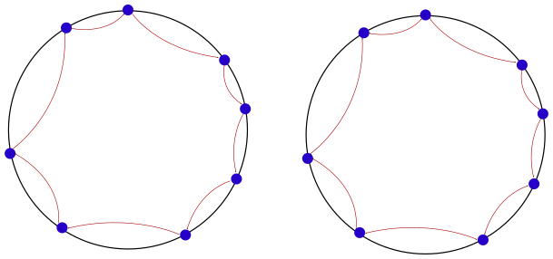
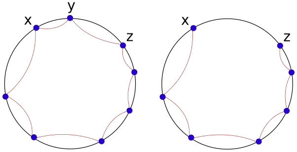
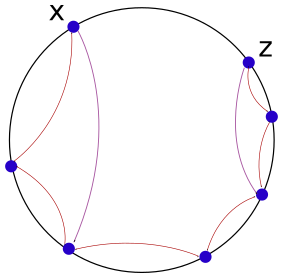
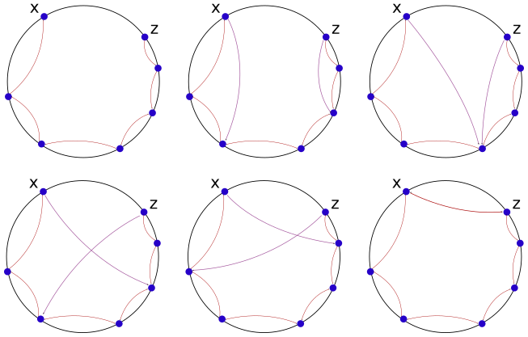
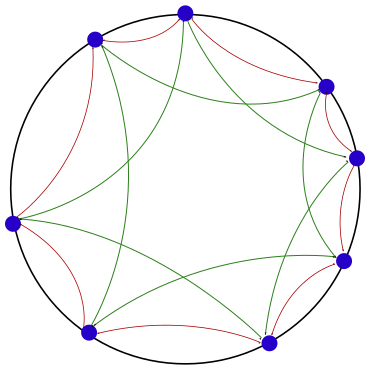
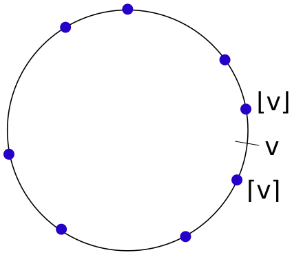

+++
title = "Stabilizing Chord"
description = ""
date = 2014-11-13 
+++


<!--
ceil and floor latex macros:
-->
$$
\newcommand{\ceil}[1]{\left\lceil{#1}\right\rceil}
\newcommand{\floor}[1]{\left\lfloor{#1}\right\rfloor}
$$

<h3>Abstract</h3>

In the [Intro to DHTs](./research/dht_intro/index.md)
article we presented a very basic idea of the chord DHT (See also [original
article](http://pdos.csail.mit.edu/papers/chord:sigcomm01/chord_sigcomm.pdf)
 and generally how to search it. We treated it pretty much as a static network
of computers. We did not invest much time on thinking about what happens when
nodes join or leave the network (Or what happens when nodes fail).

In this article we are going to discuss (Very briefly) some ideas regarding how
to preserve the connectedness and structure of the network, despite all the
frequent changes that happen, such as: Nodes joins, node leaves and failures.

Particularly, we are going to present an operation called Stabilize (Which all
nodes perform periodically). This operation allows the network to preserve its
structure. (We note that Stabilize as presented here is not the same
as Stabilize presented in the original Chord article.)

<h3>The origin of Churn</h3>
Before we get into the details, I want us to have some general picture of what
we are going to deal with, when I'm saying "Stabilize". At this point we are
not going to deal with some malicious powerful adversary that tries to destroy
our DHT (We will meet this adversary later at some point, but not today). You
may assume that all the nodes are inside some laboratory, and we own all of
them.

There are some events that could happen. First of all, there are the usual DHT
events of nodes joining and leaving. How should we handle those joins and
leaves, so that the network keeps its "original structure"? So that it stays
searchable, and even more than that: Stays connected?

Besides joins and leaves, we should also deal with nodes that fail. Why would a
node fail? There could be a few reasons. Maybe the computer broke, or someone
tripped over the LAN cable connecting the node to the rest of the computers. It
might be that power went offline, or someone pushed the restart button. We
don't really know. We just know that the failure was immediate, and the node
had no chance at all to report its failure to the network.

We are going to find at some point that this failed node is dead, but not
immediately. One inherent characteristic of the Internet, and maybe networks
generally, is that **you can not know immediately that a remote node died**.
You will find out about it after some time, eventually.

<h4>Heartbeats</h4>
How would you check if someone is dead on the real world? A good idea might be
to check if he can talk. If someone is talking, he must be alive.

A similar solution can be used over the Internet. To make sure that a remote
node is alive, you just check if he recently sent a message.
Going further with this idea, we can have the following arrangement in our
network: If $x$ is a node that is linked to $y$, $x$ is expecting to get
a message from $y$ at least as frequent as every 10 seconds. If it doesn't
happen, $x$ will assume that $y$ is dead. $y$ expects the same from
$x$.

But what if $y$ doesn't have anything important to say to $x$, and 10
seconds are soon going to pass? In that case, $y$ will send some kind of a
dummy message to $x$. A dummy message that is used to prove that $y$ is
alive.

This technique is sometimes referred to as *Heartbeat* messages.

Two notes here:

-   For the Transport Protocols savvy people: Some claim that a TCP connection
    would be enough to hold a link. It might be true in some cases, though some
    NATs will be happy to close your TCP connection if some time passes and no
    communication occurs, so sending Heartbeats is generally a good practice
    (At least in my opinion).

-   To see the theoretical incompleteness of this method of understand the
    state of a remote node, I recommend you to read about the [Two Generals'
    Problem](http://en.wikipedia.org/wiki/Two_Generals%27_Problem). (You could also
    just look at the arbitrary "10 seconds" constant, and realize that there is
    nothing very deep here).

<h4>Leaving nodes don't care</h4>
One might wonder what should a node do when he wants to leave the network. It
might seem reasonable to have some kind of predefined procedure for a node that
wants to leave the network. For example - Maybe that node would have to notify
some of his neighbours about his intentions to leave.

A way to simplify things would be to not distinguish between the case of a node
dying and a node leaving the network intentionally. We will just assume that
every node $x$ that want to leave the network will just stop responding. After some
time will pass, all the nodes that are linked to $x$ will assume that $x$
has left the network.

This is also a good security assumption (that prepares us for our future
discussions). Generally, we assume that **Leaving nodes don't care** about our
network procedures. That is because generally they have no incentives to behave
well. Joining nodes do have incentives to behave well. If they don't, we won't
help them join the network. But leaving nodes really don't care. Most likely
they have already got what they want from the network, and they can just pull
the network plug.

<h3>Stabilizing the Ring</h3>
I remind you that the chord network is just a ring of nodes (Each node
connected to the next one), with some extra links. Those extra links make
searches much faster, though they are not really needed for the search
operation to function. So lets forget about them for a moment, and go back to
the basic ring idea.

Now we are left with a very simple ring of nodes, where every node is connected
to the next node. This structure is pretty fragile. Every node that dies will
destroy the ring structure. 

One simple improvement would be that each node will remember two nodes, instead
of one. Each node will remember the previous and the next node on the ring.
Generalizing this idea: Every node will be linked to the closest node and to
the farthest node, with respect to the distance function $d$. (I remind you
that for $x,y \in B_s$,  $d(x,y) = y - x$ if $y > x$, and $d(x,y) = 2^s
+ (y - x)$ otherwise.



(On the left: A one way link ring network. Every node is connected to the next
one. On the right: A two way link ring network. It is a bit more robust.)

This time, if one node dies, the network is still fixable. Take a few moments
to think about how to fix it.

<h4>Basic Stabilize</h4>

We could add some kind of a periodic maintenance job to each node, called
"stabilize". Every node will invoke it every once in a while (Every 40 seconds,
for example). For every node $x$ we denote $x.Links$ to be the set of links
from $x$. In this case, we have that $x.Links = \{x.next,x.pref\}$.

We now define the Stabilize algorithm:

**Stabilize** [Performed by node $x$ in the case of Doubly linked ring]

1.  Initialize set $x.Known = \{x.prev,x.next\}$
2.  Ask $x$.next for his $x.next.Links$ set, and add those links to
    $x.Known$. 
3.  Ask $x$.next for his $x.prev.Links$ set, and add those links to
    $x.Known$. 
4. Remove $x$ from the set $x.Known$ (If he was there at all).
5. Let $new\_prev = argmin_{z \in x.Known}{d(z,x)}$. (In other words: Get
   the node $z \in x.Known$ such that $z$ minimizes the value $d(z,x$.)
6. Let $new\_next = argmin_{z \in x.Known}{d(x,z)}$
7. Set $x$.next = $new\_next$. Set $x$.prev = $new\_prev$.


Let's try to understand how Stabilize works. Every node $x$ asks his neighbours for
their neighbours. He then takes a look at all the nodes he know (Except for
himself), and try to find the two most suitable next and previous nodes.
The most suitable "next node" will be the node $z$ such that $d(x,z)$ is
minimized. The most suitable "previous node" will be the node $z$ such that
$d(z,x)$ is minimized.

In the usual case, performing stabilize will not change the node's next and
previous node links, however it could be useful if something has changed in the
network layout. Let's begin with the case of some node $y$ that dies.

Let's assume that $y$'s previous node was $x$, and $y$'s next node was
$z$. Therefore at some point $x$ and $z$ will notice that $y$ has died.
Both of them will miss a link at this point. $x$ will miss the "next" link,
and $z$ will miss the "previous" link. It could have been nice if $x$ and
$z$ could just somehow connect to each other, resulting in $x$.next = $z$
and $z$.prev = $x$, but in our case $x$ and $z$ do not have enough
information to do that. They just don't see far enough.




(On the left: The original state of the network. On the right: The state of the
network after $y$ has failed.


Now let's investigate what happens to $x$ and $z$ after a while. For
reasons of readability, let's just think about $x$, and conclude the same for
$z$ later. They are symmetric. $x$ will invoke the Stabilize operation
after a while. Let's mark $x$.prev = $x_1$. We will also mark the next
nodes counter-clockwise to be $x_2, x_3, \dots$.

So $x$ will ask $x_1$ (His previous link) for all his neighbours. Those
will be $x$ and $x_2$. $x$ will finally set $x$.next = $x_1$, and
$x$.prev = $x_1$. (This one was left unchanged). Please follow the
Stabilize algorithm and make sure that you understand why).



In this picture: The state of the network after one Stabilize iteration. We
mark by purple arrows the links that are not yet optimal. (They are going to
change in the next iteration of Stabilize)

Note that all other nodes will in the ring will perform Stabilize too, however
for every node that is not $x$ or $z$ the links are already optimized, so
they will not change. 

After one iteration of Stabilize we get that $x$.prev = $x_1$.
$x$.next = $x_2$. In the next iteration we will get that $x$.prev =
$x_1$, and $x$.next = $x_3$, and so on. After $O(n)$ iterations of
Stabilize, we expect that $x$.next = $z$.

We expect the same from $z$, but in the other direction. In the beginning we
have that $z$.prev is dead, and $z$.next = $z_1$. In the next
iteration we have $z$.prev = $z_2$, and $z$.next = $z_1$ (Left
unchanged). After $O(n)$ iterations of Stabilize, we will get that
$z$.prev = $x$.

It really takes a long time for this network to fix itself after one node dies,
However it is interesting to see that it fixes itself eventually. As opposed to
the one dying node case, if two nodes die the network is not connected anymore,
and there is no hope to fix it.



In the picture: The self fixing process of the network using iterations of
Stabilize (After a node $y$ failed). It is very slow.

Generally, if the network becomes not connected (There are two nodes $a,b$
for which there is no path of links leading from $a$ to $b$), there is no
hope to fix it.

Joining the network is simple in this case, and could be done without requiring
any Stabilize iterations. Think how to do it.

<h3>Thickening the Ring</h3>
One simple way to make the simple ring more robust is to add links to
more neighbours. Instead of having node $x$ linked to his immediate next
and previous neighbours on the ring, we will link $x$ to his $k$ immediate
next neighbours on the ring, and $k$ immediate previous neighbours on the
ring.



In the picture: An example ring with $k = 2$. In this network one failed node
will be fixed quickly.

We have already discussed this structure in [Intro to DHTs](./research/dht_intro/index.md)
as a naive approach for increasing search speed. This time we want to use this
structure to make the network more resilient to network churn.

As before, we denote $x$.Links to be the set of links from $x$.
We describe here the Stabilize algorithm for this case.

**Stabilize$_k$** [Performed by node $x$ in the case of $k$-linked ring]

1. Initialize set $x.Known$ to be the set of links $x$.Links.
2.  for all $t \in x.Links$ Ask $t$ for his set $t.Links$.
    Add the contents of this set to $x.Known$.
3.  Remove $x$ from the set $x.Known$ (If he was there at all).
4.  Out of all nodes in $x.Known$, find the best $k$ nodes that minimize
    $d(z,x)$ for $z \in x.Known$, and set those nodes to be
    $x.prev_1,\dots,x.prev_k$. (If there are not enough nodes in $x.Known$,
    the last prev link will be Null).
5.  Out of all nodes in $x.Known$, find the best $k$ nodes that minimize
    $d(x,z)$ for $z \in x.Known$, and set those nodes to be
    $x.prev_1,\dots,x.prev_k$.


This Stabilize algorithm is not very different from the doubly connected ring
one. (In fact, the previous Stabilize algorithm is just this one with $k=1$. 
This version of Stabilize communicates with more nodes (Usually with $2\cdot
k$ nodes). At all times a node $x$ tries to maintain a list of $k$ nodes
that are closest as possible to $x$ but not bigger than $x$, and also a
list of $k$ nodes that are closest as possible to $x$ but bigger than
$x$.

In the k-connected ring with Stabilize$_k$, if any $k-1$ nodes die the ring
will fix itself quickly. (It is enough to wait for one iteration of
Stabilize$_k$ done by all nodes in the ring). However if $k$ consecutive
nodes on the ring die at the same time, it will take longer for the ring to fix
itself, just like the case of 1 node dying in the doubly linked ring.

If $2\cdot k$ nodes die at the same time, $k$ consecutive nodes in one part
of the ring, and other $k$ consecutive nodes in another part, we expect the
network to become disconnected. 

<h3>Adding the Far links</h3>
I remind you that the fast search operation was obtained by adding links for
far nodes. We could extend the $k$-connected ring to have those links too.
That way we get a more reliable network in which we have a fast search
operation. 

Given that the name of nodes come from the set $B_s := \{0,1,2,\dots,2^{s}-1
\}$, the links we want to add to node $x$ will be: 
$\ceil{x + 1}$,
$\ceil{x + 2}$, $\dots$,
$\ceil{x + 2^{s-1}}$. For symmetry we will also add:
$\floor{x - 1}$,
$\floor{x - 2}$,$\dots$,
$\floor{x - 2^{s-1}}$.

I also remind you that by $\ceil{y}$ we mean the first node (clockwise) that has a
name bigger or equal to $y$. By $\floor{y}$ we mean the first node
(counter-clockwise) that has a name smaller or equal to $y$.



In the picture: Some value $v$, and the nodes $\floor{v}, \ceil{v}$


For simplicity's sake we will call the original links from the $k$-connected
ring *The Local links*. The new links we have just added will be called *The
Far links*. We denote $x.Local$ to be $x$'s local links,
$x.Far$ to be the far links, and $x.Links = x.Local \cup
x.Far$ to be all the nodes $x$ is linked to.

The new stabilize algorithm is as follows:

**Stabilize$^*_k$** [Performed by node $x$ in the case of $k$-linked ring with Far nodes.]

1.  Initialize $x$.Known to be the $x$.Links.
2.  for all $t \in x.Links$ Ask $t$ for his set $t$.Links.
    Add the contents of this set to $x.Known$.
3.  Remove $x$ from the set $x.Known$ (If he was there at all).
4.  Out of all nodes in $x.Known$, find the best $k$ nodes that minimize
    $d(z,x)$ for $z \in x.Known$, and set those nodes to be
    $x.prev_1,\dots,x.prev_k$. (If there are not enough nodes in $x.Known$,
    the last prev link will be Null).
5.  Out of all nodes in $x.Known$, find the best $k$ nodes that minimize
    $d(x,z)$ for $z \in x.Known$, and set those nodes to be
    $x.prev_1,\dots,x.prev_k$.

6.  For all $1 \leq j < s$: Set $x.next\_far_{j} := \arg\min_{z \in
    x.Known}{d(x+2^{j},z)}$. (In other words: We take the first (Clockwise) $z \in
    x.Known$ that has a name bigger than $x + 2^{j}$.)
7.  For all $1 \leq j < s$: Set $x.prev\_far_{j} := \arg\min_{z \in
    x.Known}{d(z,x-2^{j})}.$


A short explanation of the Stabilize$^*_k$ algorithm:
Every node $x$ first asks all the nodes he is linked to for all the nodes
they are linked to. Just to make sure you follow me here, $x$ should be
linked to about $c := \left|x.Links\right| =  2\cdot k + 2\cdot (s-1)$ nodes.
He might be actually linked to less nodes, because some Local links coincide
with Far links.

$x$ collects a set of known links. This set consists of $x$ own immediate
links, and the links sets of $x$ immediate links. This will result in no more
than $c^2 + c$ links to unique nodes.

Out of this collected $x.Known$ set, $x$ sets up the new Local and Far
links. The Local links will be the $k$ closest nodes to $x$ from the set
$x$.Known. (From both sides of $x$). To find the new Far links, $x$ will
try to find the nodes closest to $x + 2^{j}$ (and $x - 2^{j}$ for the
symmetric side).

<h4>Constructing the Far from the Local</h4>
One easy way to think about this new structure (k-linked ring + Far links) is
to separate the analysis of Local links and Far links. To get away with it, we
will first show that the Far links could always be built from the Local links
quickly. A good start would be to think about it yourself. Given a $k$-linked
ring, how can you build the Far links to enable fast search?

A good idea would be to run Stabilize$^*_k$ a few times. It seems like
Stabilize$^*_k$ deals with the Far links. Maybe it will manage to build them
correctly. We hope that running some iterations of Stabilize$^*_k$ will
converge to a structure where all the Local and Far links are optimal.

To simplify things, we assume a perfect world where all the nodes in the ring
perform Stabilize$^*_k$ exactly at the same time. (I will not discuss here
the asynchronous case, but it's a good thought experiment). We call it a
Stabilize$^*_k$ iteration.

I claim that in about $O(log(n))$ iterations of Stabilize$^*_k$ the Far
links will be fully constructed. I thought that I know how to prove it, but it
seems like I can't find an elegant way to explain it. If you have any
interesting proof (Even with conditions that are a bit different), please tell
me about it.

<h5>Stabilize code example</h5>
I don't want you to leave empty handed (You got so far already), so I
wrote a simple simulation for the Stabilize$^*_k$ algorithm in Python. It
shows how Stabilize$^*_k$ can create the Far links from the Local links in
about $O(\log(n))$ iterations. You can find it [here
[github]](https://github.com/Freedomlayer/freedomlayer_code/blob/master/chord_stabilize/build_far_from_local.py).

Some words about the code. It is not very fast. (You could optimize it though).
On my computer you could simulate a ring of 2^10 nodes, though you will have to
wait a few minutes to get a result. To use it, just run it with python. (I use
Python3). If you want to tweak the parameters, go to the last function and
change them. You can change both $n$ and $k$. $n$ is the amount of nodes
in the ring, and $k$ is the ring constant. (Every node is connected to his
$k$ closest neighbours from both sides).

If you just want to see how Stabilize$^*_k$ looks like in the code, I
include it here:
<%text>

```python
def stabilize(self,node_name):
    """
    Try improving immediate links by asking first level links.
    Done according to the Chord Stabilizing article.
    """
    # Get the node's class:
    nd = self.nodes[node_name]
    # Initialize the Known nodes set:
    known = set(nd.links)

    for ln in nd.links:
        known.update(self.nodes[ln].links)

    # Remove myself from the known set:
    known.discard(node_name)

    # Find the optimal local links:

    known_lst = list(known)
    nd.local_links = set()
    # Find "before nd" k best local links:
    known_lst.sort(key=lambda z:self.name_dist(z,node_name))
    nd.local_links.update(set(known_lst[:self.k]))
    # Find "after nd" k best local links:
    known_lst.sort(key=lambda z:self.name_dist(node_name,z))
    nd.local_links.update(set(known_lst[:self.k]))

    # Find optimal far links:
    nd.far_links = set()
    for j in range(NODE_NAMESPACE):
        # First direction:
        opt = min(known_lst,key=lambda z:self.name_dist(\
                (node_name + (2**j)) % NODE_NAMESPACE_SIZE,z))
        nd.far_links.add(opt)

        # Second direction:
        opt = min(known_lst,key=lambda z:self.name_dist(\
                z,(node_name - (2**j)) % NODE_NAMESPACE_SIZE))
        nd.far_links.add(opt)

    nd.links = nd.local_links.union(nd.far_links)
```


<h5>Local Links are enough</h5>
By showing that the Far links could be constructed from the Local links in a
short time, we can conclude that as long as the k-linked ring could be
reconstructed, the whole structure of Far Links could be reconstructed.

<h3>Final notes</h3> 
We showed that a k-linked ring survives and quickly
recovers from the sudden failure of any $k-1$ nodes. Therefore this result
applies also to a k-linked ring with Far links (Because the Far links could
always be reconstructed quickly from the Local links). This is a pretty weak
theoretical result, as we only considered the Local links when deriving it.

However, the Stabilize algorithm we have presented is much stronger than we
managed to prove here. The Far links probably add much more to the stability of
the structure. At this point we don't bother to fully analyze or prove it,
though I'm pretty sure that there many articles and research about this subject
out there.

Another interesting thing that we have found is that it is enough to invoke the
Stabilize$^*_k$ operation periodically (by all nodes) to preserve the
total structure (k-linked ring + Far links). In fact, this is the only
operation we ever have to invoke to keep up with network events. (Node failures
and joins). We don't have to remember lots of rules that apply in different cases
or times. It might not be the most optimal thing to do, however it is a very
safe way of constructing a simple and stable structure that stays both
connected and searchable.

As a thought exercise, follow what happens when a new node joins. (See how many
Stabilize Iterations it takes for him to obtain all the optimal Far links).

Another thing to mention is what we haven't discussed here: How to preserve the
information inside the nodes in the network, if we use it as a DHT. In other
words: If a few nodes fail, we already know how to reconstruct the network.
What we still have to think about is how to deal with losing the data inside
those failed nodes.
