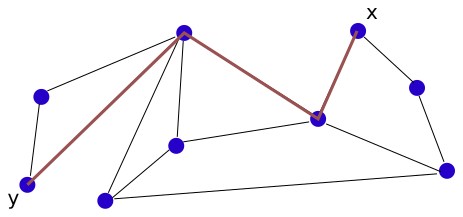
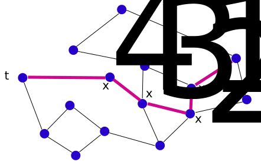
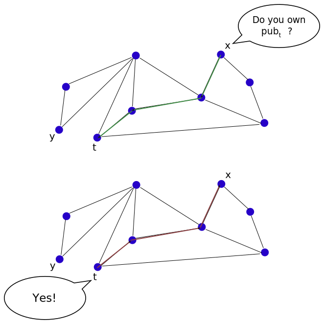
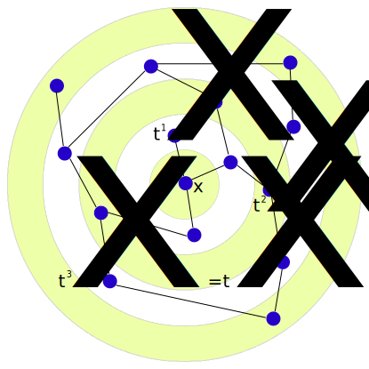
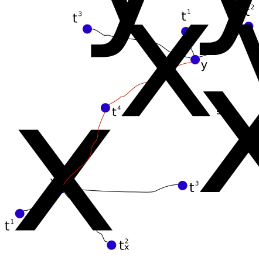
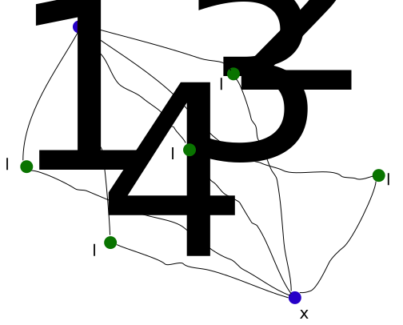

+++
title = "The Distributed Post Office: Instant Hierarcy for mesh networks"
description = ""
date = 2014-12-17 
+++


<h4>Abstract</h4>

We introduce the Distributed Post Office, an idea for routing messages in a
decentralized mesh network. The Distributed Post Office is a method for
creating an instant hierarchical structure from a mesh network.

We describe the basic form of the Distributed Post Office, and mention two
improvements to its structure.

Next, we run some [experiments
[github]](https://github.com/Freedomlayer/freedomlayer_code/tree/master/dist_post_office).
Our results show that the Distributed Post Office in its current form does not
scale well as a solution for routing messages in large networks.

In this text we do not discuss security or reliability topics related to the
Distributed Post office.

<h4>The distributed post office question</h4>

What if there there were no post offices in the world, and you wanted to send a
package to some far friend?

Assume that you meet some people you trust on a regular basis. More generally,
assume that every person $x$ in the world meets a few people he trusts on a
regular basis. We also call those trusted regulars of $x$ the **neighbours**
of $x$. If $y$ is a neighbour of $x$, we also say that $x$ is a
neighbour of $y$. The neighbours relationships could be used to transfer
packages. 

For the feasibility of things, let's also add in the assumption that
this system is connected. This means: We can get from any person to any other
person using a sequence of neighbours. Or, in other words: If we draw a graph
of all the people in the world (As nodes), and put edges between every person
and his neighbours, then we get a connected graph.



In the picture: A connected network of people. There is a path of neighbours
that connects $x$ and $y$.

Would these assumptions be enough to let us send a message to anyone in the
world?

A few initial thoughts:

- Person $a$ can send a package to person $B$ only if there is a "path" of
  neighbours between $a$ and $b$. That means: $a$ has some neighbour
  $a_1$, and $a_1$ has some neighbour $a_2$ and so on, until finally some
  $a_k$ has $b$ as a neighbour.

- The lack of any centralized post office might create the urge to create one.
  This artificial post office might be some person that everyone knows.
  However, picking such a person that is agreed upon all the participants might
  be difficult task.

- What kind of addressing are we going to use for sending packages, if there is
  no central post office? (What are we going to write on the package on the
  "TO" field?) And what if the network layout changes? Will the address remain
  valid?

<h4>Basic Distributed Post office</h4>

<h5>Finding the highest person</h5>

One way to solve this is finding some special person. This person will be used
as a reference point for sending messages. All our messages will pass through
this person. This centralized point of view is a bit different from our usual
decentralized point of view, but it will present some idea that we
might later be able to utilize in a decentralized way, so bear with me here.

Finding a special person could be achieved as follows: Every person $x$ will
maintain a link (Maybe through a few neighbours) to the highest person he knows
of (We assume that there are no two people of the exact same height). By
maintaining a link we mean that $x$ will remember some person $y$, his
height and a path from $x$ to $y$ that goes through neighbours.

Initially, every person $x$ will look at his neighbours (And himself), and
find the highest person among them. Then $x$ will inform all his neighbours
of the highest person he knows (He will also send his path to that person).
Next, $x$ will look at all the highest known people he received from his
neighbours. He will update his highest known person accordingly.

The algorithm could be described simply as follows: In every iteration,
every person $x$ sends to all his neighbours the highest person $y$ that he
knows, and also the shortest path he knows from $x$ to $y$. (Iteration
could happen every few seconds, for example).

After enough iterations, we expect that every person $x$ will find the
highest person in the world $t$. In addition, $x$ will know a shortest path
possible from $x$ to $t$.


Let's explain this result: Why do we expect that the highest person $t$ will
always be found by all people, and also that a shortest path will be found?

Assume that $x$ is some person, and $t$ is the highest person in the world.
There is some shortest path of neighbours between $x$ and $t$ (However
$x$ doesn't know that path yet). Let's assume that this path of neighbours
have the people: $(x,x_1,x_2,\dots,x_{k-1},x_k,t)$ in this order. 



In the picture: A shortest path between $x$ and $t$. Note that this is not
the only shortest path between $x$ and $t$.

After the first iteration, $x_k$ will have $t$ as the highest person in the
world. $x_k$ will also have a shortest path to $t$. In the next iteration,
$x_{k-1}$ will know $t$ as the highest person in the world (Because $x_k$
has told him about it). $x_{k-1}$ will also know a shortest path to $t$:
The path: $(x_{k-1},x_{k},t)$. What if this is not the shortest path? Then
there must be some path of length two, as follows: $x_{k-1},t$. In that case,
there is also a shorter path between $x$ and $t$:
$(x,x_1,x_2,\dots,x_{k-1},t)$. But this will contradict our assumption that
$x,x_1,x_2,\dots,x_{k-1},x_k$ is a shortest path between $x$ and $t$.

We can continue this argument until we get to $x$. (The formal way to do it
is using mathematical induction). Then we conclude that after $k+1$
iterations, $x$ will have $t$ as the highest person in the world, and $x$
will also have a shortest path from $x$ to $t$.

Another way to think about it is that the amount of iterations needed until
every person finds the highest person in the world is not more than the
[diameter](http://en.wikipedia.org/wiki/Distance_%28graph_theory%29) of the
neighbours graph.

We don't really deal with security here, but I want to mention this question:
Whenever a person sends to all his neighbours the highest person he knows, how
can we know he doesn't lie? We will deal with this later.

<h5>Addressing and Drift</h5>

So far we got some special person $t$ that every person can reach: Every
person $x$ knows a path to $t$, and thus $x$ can send a package to $t$.

How could $x$ send a message to some arbitrary person $y$? $x$ already
knows the path from $x$ to $t$. If $x$ knew a path from $t$ to $y$,
he could first deliver his package to $t$, and then ask $t$ to send his
package to $y$.


This idea leads us to choose the address of an arbitrary node $y$ as a
shortest path between $t$ and $y$. (This is the reversed path between $y$
and $t$). We will mark this as the address of $y$, or **$A(y)$**. 

Given $A(y)$, $x$ can send a package to $y$ by sending the package first
to $t$, with the address $A(y)$ written on the package. $t$ will then use
the path $A(y)$ to deliver the message all the way to $y$.

We ignore the centrality issues of this idea for a moment ($y$ has to deal
with all the packages sent in the world!!!), and try to think about the
addressing idea.

$y$'s address is induced from the structure of the network of neighbours.
Certain changes could invalidate $y$'s address. In other words: There is a
drift in the addresses, as the network of neighbours changes.

One way to deal with this issue is to **refresh** the addresses from time to
time: If $x$ is in contact with $y$, then $y$ will send his current
address to $x$ every few seconds. $x$ will also send his current address to
$y$ every few seconds. This might not be very reliable, but it's an idea.


<h4>Changing people into nodes</h4>

Formally we solved the problem of delivering packages, however the solution is
not very satisfying. All the packages has to go through some special person.
This is not good for us because of security reasons (Could we trust the special
person), and also because of load issues (Just because he is the
highest person in the world, he has to deal with all the packages?)

Before we start proposing more ideas, it is probably a good time to change our
terminology to networks and nodes. We get the following question: Assume that
we are given a mesh network, where every node has a few neighbours. How can we
deliver messages between every two arbitrary nodes?

Note that we already tried to solve this question using
[flooding](http://en.wikipedia.org/wiki/Flooding_%28computer_networking%29),
[$sqrt{n}$
routing](./research/sqrt_n_routing/index.md)
and
[Virtual DHT
routing](./research/exp_virtual_dht_routing/index.md).

Instead of checking the height of people, we can use some other properties of
nodes. We will use some [public key
cryptography](http://en.wikipedia.org/wiki/Public-key_cryptography). 
Every node $y$ will create a key pair $prv_x,pub_x$ (Private and Public).
We assume that every node $x$ knows the public keys of all his neighbours.

Next, we choose some [cryptographic hash
function](http://en.wikipedia.org/wiki/Cryptographic_hash_function) $h$.
Instead of person $x$'s height, we will take a look at $h(pub_x)$. We will
call this value $x$'s height.  The highest person in the world will turn into
the node $t$ that maximizes the value $h(pub_t)$. In that case we will also
say that $t$ is the "highest" node in the network with respect to the
cryptographic hash function $h$.

While it was difficult to verify the height of a person from a
distance, we could verify the public key of a node from a distance.
If node $x$ is informed by node $y$ about some remote node $t$ that has a
certain $h(pub_t)$ value, $x$ can verify it himself. $x$ can send some
challenge all the way to $t$, and $t$ will send back a response that proves
he owns the public key $pub_t$. 



In the picture: $x$ wants to verify that $t$ owns the public key $pub_t$.
Therefore $x$ sends a challenge to $t$. If $t$ returns a correct
response, $x$ will believe that $t$ owns the public key $pub_t$.

Note however that this challenge response idea is not a magic cure to all the
security problems in this model. It just helps a bit.


<h4>Adding hierarchy</h4>

<h5>Highest node in some radius</h5>
One approach to make things better is to create some kind of hierarchy. Earlier,
every node $x$ maintained contact to the "highest" node in the network (with
respect to some cryptographic hash function $h$) through some path of nodes. 

This time, instead of remembering just the "highest" node in the network, every
node $x$ will remember a few special nodes. Every node will be the "highest"
in some certain area around $x$:

- $t_x^1$: The "highest" node of maximum distance $1$.
- $t_x^2$: The "highest" node of maximum distance $2$.
- $t_x^3$: The "highest" node of maximum distance $3$.

...

- $t_x^d$ The "highest" node in the network.




In the picture: Distance rings around $x$. The first ring is distance $0$
from $x$. It contains only $x$ itself. The next ring contains all nodes of
distance exactly $1$ from $x$. The next ring contains all nodes of distance
exactly $2$, and so on. Note that by definition, A node from a certain ring
can only be connected to nodes of adjacent rings, or nodes from the same ring.

We mark by $t_x^j$ The "highest" node of maximum distance $j$ from $x$.
In our example, $t_x^3 = t_x^4$.


Side question: How can we choose a good value for $d$? One suggestion is to
keep increasing the distance until we stop getting new highest nodes. Another
suggestion would be to just assume that the graph diameter won't be more than
some constant number.


First let's assume that somehow we managed to have the above information for
every node in the network, and see what we can do with it. (Note that we didn't
yet describe how to get this information. It will be described soon later). 

We define $x$'s address to be $A(x) = (p_x^1,p_x^2,\dots,p_x^d)$, where
$p_x^j$ is the path from $t_x^j$ to $x$. This definition of $A(x)$ is
an extension of our previous definition of $A(x)$, where we only had the
$t_x^d = t$. Also note that looking at some $p_x^j$, one can conclude
$t_x^j$ (It is just the first node on the path).

Looking at two different nodes: $x,y$, the first thing to note is that
$t_x^d$ and $t_y^d$ are the same, assuming that $d$ is large enough. Why?
Because $t_x^d = t_y^d = t$, the highest node in the network. For other
distances, the nodes $x$ and $y$ have chosen might differ. For example,
$t_x^1$ and $t_y^1$ are likely to be different.

How to deliver messages using the address information? Assume that $x$ has
the address of $y$: $A(y)$, as described above. $x$ will compare his own
address: $A(x)$ with $A(y)$. $x$ will try to find the smallest $j$ such
that $t_x^j = t_y^j$. $x$ knows a shortest path from $x$ to $t_x^j$.
$x$ also knows $A(y)$, So $x$ knows $p_y^j$, which is a shortest
path from $t_y^j = t_x^j$ to $y$. Finally, $x$ can create a full path
from $x$ to $y$ that goes through $t_y^j = t_x^j$. This path could be
used to send messages.



In the picture: The node $t_x^4 = t_y^4$ is a mediator between $x$ and
$y$. $x$ and $y$ can route messages through $t_x^4 = t_y^4$.

Addresses should not be too large if we want them to be practical to use. Let's
estimate the size of a typical address, as defined above. For some node $x$,
$x$'s address is $(p_x^1,p_x^2,\dots,p_x^d)$. Every such $p_x^j$ is a
path. Assuming that the diameter of the network graph is $d$, we get that
each path is of length no more than $d$. Therefore we get at most $d^{2}
q$, where $q$ is the size of a typical public key. This could become more
than a few kilobytes if the public key size and the network diameter are big.
(Much more than an IP address, unfortunately).


<h5>Obtaining "highest" nodes</h5>

We now explain how a node $x$ can obtain contact to the nodes
$t_x^1,\dots,t_x^d$. (And also a shortest path to each of those nodes).

In every iteration, the node $x$ will ask every neighbour $y$ for the value
$t_y^j$ for every $1 \leq j \leq d$. Then $x$ will update his values of
$t_x^j$ accordingly: 
The value $t_y^j$ from $y$ is a candidate for $t_x^{j+1}$. If $t_y^j$
is "higher" than $t_x^{j+1}$, then $x$ will replace it with $t_y^j$.

Simply speaking: In iteration number $k$, a node $x$ is aware of all the
"highest" nodes in the network until distance $k$.

Formally, Using mathematical induction (Over the amount of iterations) it can
be shown that after $k$ network iterations, Every node $x$ knows the
correct value for $t_x^j$ for every $1 \leq j \leq k$, and also a shortest
path to $t_x^j$.

<h5>Hierarchy benefits?</h5>

Why would we want to have hierarchy from the first place? Earlier we complained
that all the messages will go through one special node $t$, and $t$ won't
be able to deal with the load. Maybe the hierarchy we have added can help a
bit.

How often will a message go through the "highest" node $t$? 

Assume that $x$ wants to send a message to some node $y$. $x$ checks
$y$'s address, and tries to find the first $j$ such that $t_x^j =
t_y^j$. (As described above). If any small enough such $j$ is found, the
message will be routed through $t_x^j = t_y^j$, and not through the "highest"
node $t$. We can think of $t$, the "highest" node, as some kind of backup.
If nothing better was found, we can always route through $t$.

But how do we know if $x$ will route his message to $y$ through $t$, or
through some lower level node $t_x^j = t_y^j$? Generally speaking, we expect
that the more $x$ and $y$ are close, the more their addresses $A(x),A(y)$
are similar, and the more likely it is to route the message using a "high" node
that is not the "highest" node in the network.


<h6>The "highest" node is still overloaded</h6>

We expect that messages between close nodes are routed using a local "high"
node, while messages between very far nodes are routed using a globally "high"
node. Therefore **idealy** we expect that the "highest" node in the network
will not be so loaded, because the lower level "high" nodes will take part of
the load.

<del>This somehow resembles the way physical post offices work. You have
the global post office which handles messages between countries, and smaller
post offices that handle messages between cities, and so on.</del>
EDIT: Thanks to rubygeek I now know that post offices work differently in some
countries :)

However, this is just the ideal. It is true that the local "high" nodes in the
network take part of the load from the "highest" node in the network, but
usually they only take a small part of it. Intuitively, this happens for a few
reasons:

- In physical mail system people tend to send packages and letters to people
  close to them geographically, so the structure of global post offices and local
  post offices makes sense. However, this is not the case with mesh networks: In
  a mesh network, any two arbitrary nodes $x$ and $y$ might want to
  communicate. With high probability $x$ and $y$ are far away from each
  other (With respect to the network graph), and so their messages will be routed
  through the "highest" node in the network.

- In a grid style graph (Or any [planar
  graphs](http://en.wikipedia.org/wiki/Planar_graph)), close nodes are expected
  to have many "high" nodes in common. However, for other types of graphs, close
  nodes might only have the "highest" node in common.


I want to discuss the second reason with a bit more detail. (Though with a bit
of hand waving). You can skip directly to the code experiments results below.

For some node $x$ in the network, we denote by $R_j(x)$ the set of nodes of
distance no more than $j$ from $x$. You can think about it as a ball around
$x$ of radius $j$.

Consider two nodes $x$ and $y$ in the network. We observe the sets $R_i(x)
\cap R_j(y)$ and $R_i(x) \cup R_j(y)$.


A schematic picture of the sets $R_i(x)$ and $R_j(y)$ intersecting.
$R_i(x)$ contains all the nodes of distance at most $i$ from $x$.
$R_j(y)$ contains all the nodes of distance at most $j$ from $y$.

Let $w$ be the "highest node in $R_i(x) \cup R_j(y)$. If $w$ is inside
$R_i(x) \cap R_j(y)$ then $t_x^i = w = t_y^j$. (In other words: $w$ is
the "highest" node in distance $i$ from $x$, and the "highest" node in
distance $j$ from $y$). In that case, $x$ and $y$ could route messages
through $w$.

What are the odds that such $w$ exists? As the "highest" node in $R_i(x)
\cup R_j(y)$ could be any node in that set, the odds are: 
\[\frac{\left|R_i(x) \cap R_j(y)\right|}{\left|R_i(x) \cup R_j(y)\right|}\]

I don't know to calculate those odds for every type of graph, but let me leave
you with my intuition about it. For every type of graphs, the odds for the
existence of $w$ decrease as the distance between $x$ and $y$
increases. However, for some graphs the odds decrease slowly, and for other
graphs, the odds decrease quickly.

The odds decrease slowly (Quadratically) when we consider a planar graph, like
a grid. However, for random graphs (Like the [Erdos-Renyi
model](http://en.wikipedia.org/wiki/Erd%C5%91s%E2%80%93R%C3%A9nyi_model)) the
odds decrease quickly (exponentially).

This might be related to the fact that intersection between higher dimensional
spheres becomes smaller with respect to their union, as we increase the
dimension.

<h6>Experiments results</h6>

I wrote some Python3 code to check the load over the "high" nodes in the
network. It can be found [here
[github]](https://github.com/Freedomlayer/freedomlayer_code/tree/master/dist_post_office)

To run this code, you will need the python package **networkx**. I could be
installed as follows:

```bash
pip install networkx
```

If you want to change any parameter in the code, check out the go() function.
All the parameters are there.

The code creates a network $G$ of nodes with random identity numbers. Using
iterations as described above (In "Obtaining highest nodes"), every node $x$
finds the highest node in distance $j$, for every distance $0 < j \leq
diameter(G)$.

After creating the network and finding the "high" nodes, some large amount of
pairs of nodes are chosen randomly. Between every pair of nodes $x,y$ the best
mediator node is found. A mediator node is some "high" node that both $x$ and
$y$ know. A best mediator is a mediator that minimizes the sum of distances
from $x$ and $y$.

For every mediator ever chosen, we count the amount of messages that were
routed through that mediator. We sort the mediators list by the amount of
messages they have routed, and show as output the mediators that routed the
largest amount of messages. Those are the mediators that had the highest load.

These are the results for a two dimensional grid graph of about $2^{12}$
nodes, and simulation of $2^{16}$ messages.

```
||| i = 12
||| num_hashes = 1
||| ident_bits = 32
Generating graph...
Generating Network...
Calculating specials...
Simulating 65536 messages delivery...

most common mediators:

 mediator index  | ratio      | messages routed 
------------------------------------------------
             565 |   0.507568 |           33264 
            3251 |   0.210510 |           13796 
            3661 |   0.078995 |            5177 
            1573 |   0.058914 |            3861 
            3724 |   0.031265 |            2049 
            1806 |   0.022171 |            1453 
            3333 |   0.018906 |            1239 
            1341 |   0.006180 |             405 
             159 |   0.006027 |             395 
            1884 |   0.005585 |             366 
            2047 |   0.005035 |             330 
             978 |   0.003891 |             255 
            3109 |   0.003662 |             240 
             377 |   0.002518 |             165 
              26 |   0.002228 |             146 
            2269 |   0.001862 |             122 
```

How to read this table? Mediator index is a unique number that identifies the
node used as a mediator. In our code, every node has a unique number. This
number doesn't really matter to you. (If you really care, it is the index
number inside a python list)

The ratio is the amount of messages routed through a given node, divided by the
total amount of messages delivered. In our results the first ratio is
$0.507$. This ratio could be calculated as $33264/65536$. The last column
shows the amount of messages routed through a specific node.

It can be seen from the table that the first node (565) routes most of the
messages (about half of the messages). It is probably the "highest" node in the
network.

Next, let's look at the results for an Erdos-Renyi Random graph with $2^{12}$
nodes, and $p = (2\cdot 12)/{2^{12}}$ (This is the probability for every
edge in the graph to exist). Again we simulate the delivery of $2^{16}$
messages.

```
||| i = 12
||| num_hashes = 1
||| ident_bits = 32
Generating graph...
Generating Network...
Calculating specials...
Simulating 65536 messages delivery...

most common mediators:

 mediator index  | ratio      | messages routed 
------------------------------------------------
            3425 |   0.918594 |           60201 
            2300 |   0.029877 |            1958 
            3935 |   0.012985 |             851 
            3232 |   0.006516 |             427 
            2453 |   0.005585 |             366 
             767 |   0.004410 |             289 
            2281 |   0.003174 |             208 
             943 |   0.002869 |             188 
             457 |   0.002625 |             172 
            2189 |   0.002319 |             152 
            3682 |   0.001694 |             111 
            3215 |   0.001648 |             108 
             641 |   0.001144 |              75 
            1049 |   0.000565 |              37 
            3469 |   0.000534 |              35 
             782 |   0.000519 |              34 
```


It can be seen that there is a main difference between the results of the
Erdos-Renyi model and the two dimensional grid. In the Erdos-Renyi model the
ratios are more condensed to the upper part of the table. The most common
mediator routes 0.91 of the messages. (Compared to about half in the grid
case). Also note that the rest of the ratios decrease much faster in the
Erdos-Renyi model, compared to the two dimensional grid.

<h4>Adding hash functions</h4>

Another idea to take off the load from the "highest" node in the network would
be to add more cryptographic hash functions.

Recall that the "highest" node in the network, $t$, is a node that maximizes
the value $h(pub_t)$, for some cryptographic hash function $h$. We could
add a few more cryptographic hash functions, to end up with a few "highest"
nodes, one for each hash function. The process of obtaining "highest" nodes
for different distances will be invoked independently for each of the hash
functions.

With more hash functions, every two nodes $x,y$ are likely to have more
"high" nodes in common with respect to a few different hash functions. On the
other hand, having $k$ hash functions means having an address that is $k$
times bigger. (Because it contains paths to highest nodes for $k$ different
hashes). It also means that every node has to maintain contact with $k$ times
more nodes.


You might be wondering where will we get all those cryptographic hash functions
from. If you have one cryptographic hash function $h$, you can get more for
free by appending something to the input. For example, given a function $h$
we can define $h_i(x) = h(i . x)$, where $.$ is string concatenation. 

This is a pretty simple example of how to do it, and it could be [not very
secure in some cases](http://en.wikipedia.org/wiki/Length_extension_attack), so
be careful. We are just experimenting here, so we don't really care.


Let's look at some run results with more than one hash function.
We show here the results for an Erdos-Renyi network with $2^{12}$ nodes, and
$p = (2\cdot 12)/2^{12}$. We use $4$ hash functions:

```
||| i = 12
||| num_hashes = 4
||| ident_bits = 32
Generating graph...
Generating Network...
Calculating specials...
Simulating 65536 messages delivery...

most common mediators:

 mediator index  | ratio      | messages routed 
------------------------------------------------
            3685 |   0.189270 |           12404 
            2935 |   0.189026 |           12388 
            2010 |   0.187103 |           12262 
            3136 |   0.186569 |           12227 
            2466 |   0.025085 |            1644 
            3546 |   0.021988 |            1441 
            3886 |   0.021057 |            1380 
            1330 |   0.015961 |            1046 
            2039 |   0.010941 |             717 
             400 |   0.010269 |             673 
             761 |   0.009781 |             641 
            1057 |   0.008957 |             587 
             502 |   0.006882 |             451 
            2890 |   0.006760 |             443 
            2487 |   0.005554 |             364 
            3204 |   0.005341 |             350 
```


We can see from the results that the first $4$ most common mediator nodes
route about the same amount of messages: About 0.18 of all the messages sent.
The rest of the nodes route much less messages. (The next one routes 0.02
messages out of the total amount).

It seems that having $k$ cryptographic hash functions approximately
divides the amount of work the "highest" node has to do by $k$. It's an
improvement, but it seems like each of the "highest" nodes still has to route a
constant fraction of all the message sent in the network, which is unacceptable
for a symmetric mesh network. (In other words: The average computer out there
can not deal with this amount of traffic).

<h4>Final simplification</h4>

We began with a simple idea of the "highest" node in the network, and later
added two improvements: First, every node $x$ had to remember the "highest"
node of distance $j$: $t_x^j$, for every $0 < j \leq diameter(G)$. Next,
we added some more "height" properties. In other words: We added more hash
functions.

We noticed that the first improvement: remembering local "high" nodes didn't
help much. It took some of the traffic from the "highest" node in the network
to some other local "high" nodes, but still most of the traffic was routed by
the "highest" node in the network.

The second improvement: Changing to $k$ hash functions instead of one made a
bigger difference. Instead of having just one "highest" node in the network,
now there are $k$ of them, and the task of routing the network messages is
divided somewhat equally between those $k$ "highest" node. 

We could discard the first improvement (Remembering local "high" nodes), and
stay only with the second improvement (Adding more hash functions).  That
means: Every node will have to remember one "highest" node $l_j$ for every
one of $k$ hash function. Note that $l_j$ is the "highest" node in the
network with respect to hash function number $j$. All the messges sent in the
network will then be routed by the $k$ "highest" nodes $l_1,\dots,l_k$.
(One "highest" node for every cryptographic hash function).

Using this simpler method we are going to have results comparable to the more
complex method described above, and at the same time have much shorter
addresses for nodes. We call the $k$ "highest" nodes in the graph **the
$k$ landmarks**.



In the picture: The nodes $l_j$ for $1 \leq j \leq 5$ are the landmarks
used for routing messages. $l_j$ is the "highest" node in the network with
respect to cryptographic hash function number $j$.Each node in the network
maintains a shortest path to each of the landmarks.

Note that each message sent in the network will be routed through one of the
landmarks, therefore each landmarks is going to route about $1/5$ of all the
messages in the network.

In the example: Both $x$ and $y$ keep contact with each of the $5$
landmarks, so messages between $x$ and $y$ could be routed using any of
those $5$ landmarks.

We end up with a routing method that is not very practical for large networks,
but it gives us some new ideas about routing. This method will serve as a
starting point for some of our next ideas.

<h4>Summary</h4>
The Distributed Post Office is an algorithm for creating a hierarchical
structure in a decentralized mesh network.

Our results show that the Distributed Post Office works, but not very
efficiently: A few nodes (The "highest" node with respect to every hash
function) have the responsibility of routing messages for the whole network.

In our last simplified solution, every node has to remember exactly $k$
landmarks: The "highest" nodes with respect to $k$ different cryptographic hash
functions. In this solution we get that every landmark has to route $1/k$ of
the messages sent in the network.

A question to think about: Is there a way to route the messages in the network
using the knowledge about the $k$ landmarks, without actually routing the
messages through the landmarks themselves?

