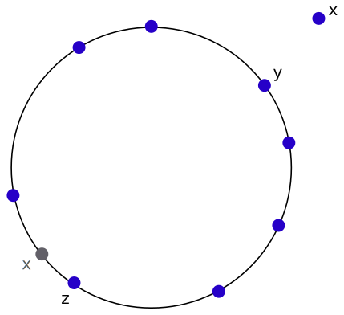
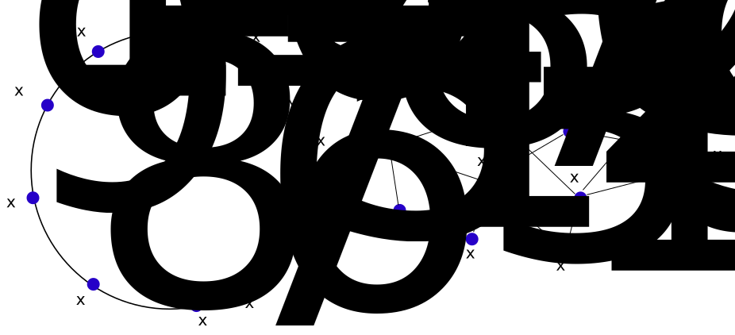
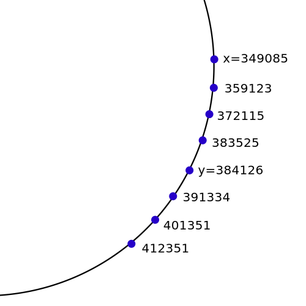
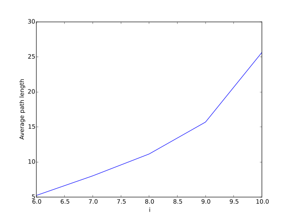

+++
title = "Experimenting with Virtual DHT Routing"
description = ""
date = 2014-12-14 
+++


<h4>Abstract</h4>

We introduce the Virtual DHT idea for routing messages in a mesh network. We
describe a crude algorithm that builds a Chord Virtual DHT. Next we run some
[experiments
[github]](https://github.com/Freedomlayer/freedomlayer_code/tree/master/exp_virtual_dht_routing)
to measure the algorithm's ability to create a Virtual DHT efficiently. We also
measure the expected amount of hops required to deliver a message using this
method. 

Our experiments results show that Virtual DHT routing might work for networks
of certain size, but at this time we do not know how the results scale to
larger networks.

We don't present any formal (mathematical) results regarding the idea of
Virtual DHT, and we don't discuss reliability and security issues.

<h4>The message routing problem and related work</h4>

Assume that we have $n$ correct (honest) nodes (We will not consider any
Adversary at the moment), connected somehow in a mesh. Every node is linked to
a few other nodes. We call these nodes his immediate neighbours.  
Nodes in the mesh have only local knowledge. They only know about their
immediate neighbours. They don't know about the general structure of the mesh
network.

For any two nodes $a,b$ in the network, we want to be able to send a message
from $a$ to $b$. We care that this message will arrive with high
probability, quickly enough, and also that it won't disturb too many nodes in
the network.

We have seen so far a few ways of routing messages in a mesh network: Flooding
(See [The mesh
question](@/research/mesh_question/index.md) and
[sqrt(n) routing](@/research/sqrt_n_routing/index.md).

Flooding was pretty inefficient (However pretty robust and secure). The idea of
$\sqrt{n}$-routing was a bit more efficient, though it required that every
node will maintain contact with $\sqrt{n\log{n}}$ virtual neighbours.

We will consider here a different approach for routing messages in a
decentralized mesh network: Using a "Virtual DHT". This idea is based on the
articles [Virtual Ring Routing: Network Routing Inspired by
DHTs](http://research.microsoft.com/pubs/75325/virtualring.pdf) and [Pushing
Chord into the Underlay: Scalable Routing for Hybrid
MANETs](http://os.ibds.kit.edu/downloads/publ_2006_fuhrmann-ua_pushing-chord.pdf).
This method is sometimes also called [Scalable Source
Routing](http://en.wikipedia.org/wiki/Scalable_Source_Routing).

A similar method apparently has a working implementation in the
[CJDNS](http://en.wikipedia.org/wiki/Cjdns) project. (Also see the
[whitepaper](https://github.com/cjdelisle/cjdns/blob/master/doc/Whitepaper.md))
I didn't manage to figure out from CJDNS whitepaper the specific details of the
implementation, though it seems like it uses the Kademlia DHT. We are going to
use Chord in this text.

<h4>Motivation for using a DHT</h4>

Recall that a [DHT](research/dht_intro) is
a special structure of links between nodes. This structure allows to find a
specific node (or key) quickly (In about $\log{n}$ iterations). If we
managed somehow to create a DHT between the nodes in the mesh network, we might
be able to find any wanted node quickly, and also pass messages quickly between
nodes.

<h4>Why can't we just use a regular DHT?</h4>

Why is this case different from our previous discussion about DHTs?  We already
know how DHTs work, why can't we just use a regular DHT to be able to navigate
messages in a network?

The answer is that creating a working DHT depends on our ability to send
messages "by address". In other words, to have a working DHT, we need to rely
on some structure like the internet. Thus trying to build something like the
internet using a DHT is kind of cyclic, when you think about it.

Let me explain it in detail. Let's recall how a DHT works. Whenever a node
$x$ wants to join the DHT, $x$ contacts some node $y$ that is already
part of the DHT. $y$ then finds the node closest to $x$ (By DHT Identity
distance) inside the DHT. Let's call that node $z$. $y$ then sends to $x$
the address of $z$. Finally, $x$ can connect to $z$ and join the DHT.



In the picture: $x$ wants to join the network. Marked in gray is the place in
the ring where $x$ is supposed to be, right after $z$.

This would work if we have a structure like the internet to support the idea of
address. However, if we are working in a simple mesh, how could $y$ connect
$x$ to $z$? We don't yet have any notion of address, so it is a hard task
for $y$ to introduce $z$ to $x$.

The act of "introducing nodes to other nodes" is something that happens a lot
in a DHT. In particular, it happens whenever a node wants to join the network,
and also every time that a node performs the stabilize operation. 


One naive method to introduce nodes in a mesh is using paths. Assume that $y$
wants to introduce $z$ to the node $x$. $y$ knows a path $path(y,z)$
from $y$ to $z$, and also a path $path(y,x)$ from $y$ to $x$. $y$
can use those two paths to construct a path $path(x,y) + path(y,z)$ from $x$ to $z$.

$y$ can send $path(x,y) + path(y,z)$ to $x$. Then whenever $x$ wants to send a
message to $z$, $x$ will use the path $path(x,y) + path(y,z)$.


In the picture: The path between $x$ and $z$ is the concatenation of paths
between $x$ and $y$, $y$ and $z$.

This method sounds like a solution, but it has a major flaw: The path
$path(x,y) + path(y,z)$ that we get from $x$ to $z$ is not optimal. It is
not the shortest path possible. What if $x$ wants to introduce $z$ to some
other node $w$? If we keep using the naive paths methods, $w$ will end up
with a path $path(w,x) + path(x,y) + path(y,z)$ from $w$ to $z$, which
could be pretty long.

After a while in the DHT, we might get to a situation where the paths become
too long to handle. In the next sections we will try to think of a solution.

<h4>Setup</h4>

To use a DHT we need DHT Identities for all the participants. For the rest of
this text we will use the Chord DHT, and we will choose a random Identities from
$B_s = \{0,1,2,\dots,2^{s} - 1\}$, where $s$ is large enough. (In practice
we could choose the Identities in [some other
way](research/dht_basic_security),
but let's assume for now they are just random)

Between every two nodes $x,y$ (We use the notation $x$ to denote both the
Identity value and the node itself) we will define two notions of distance
(Which are unrelated):

- The Network Distance: The length of the shortest path between the nodes
  $x,y$ in the network.

- The Virtual Distance: The value $d(x,y) = (y - x) \mod 2^{s}$. This is the
  distance we when we described the Chord DHT.


In the picture: On the right we can see an example for a mesh network. On the
left, we can see the Virtual DHT. Note that there is no relation between
distances on the mesh and distances in the Virtual DHT. The Virtual Distance
between $x_{10}$ and $x_9$ is pretty short, however in the mesh they are
very far.

Note that two nodes could have very short Network Distance though very long
Virtual Distance, and vice versa. It is crucial to understand that the Network
Distance and the Virtual Distance are unrelated.

<h4>Converging the ring</h4>

To maintain a Chord DHT, every node should at least know about its successor
with respect to the DHT Identity. (This will form the basic Chord ring).
We will begin by finding out some way in which every node will find a mesh path
to his successor and predecessor with respect to the DHT Identity. (Somewhat
surprisingly, finding just the successor is harder than finding both the
successor and predecessor at the same time).

Finding the immediate successor and predecessor for every node $z$ will allow
us to send a message (In a very inefficient way) between every two nodes
$x$,$y$. Assume that $x$ wants to send a message to $y$. $x$ knows a
path to his DHT successor, $x_1$. $x$ will send the message to $x_1$, and
ask $x_1$ to pass the message to $y$. $x_1$, in turn, will send the
message through a known path to his successor on the ring, $x_2$, and so on,
until the message will arrive at $y$.

Why is this inefficient? First, only from the DHT (Virtual) perspective, the
message will go through about half the nodes in the DHT. Next, when looking at
the mesh, we find that passing the message from some node $t$ to his
successor goes through even more nodes in the mesh. How many nodes? It depends
on our mesh. If it's a random graph, the distance between two random nodes
could be something like $\log{n}$. If it's more like a grid (This might
happen if you deploy wifi antennas on some large surface), then the average
path might be longer.
It seems like our message will go through more than $n$ nodes, which is too
much. Flooding could probably perform better.

But it is still a start. Maybe sending messages will be very inefficient, but
we still get a way to find a path from one node to another. It might give us
some ideas about how to move on. As a conclusion, our first task is finding the
successor and predecessor (With respect to the DHT) for every node $x$ in the
network.

<h5>Asking the neighbours</h5>

Every node $x$ has only local knowledge of the network. In fact, a node $x$
in the mesh network really knows nothing besides his immediate neighbours. We
may also assume that $x$ knows the DHT Identity of each of his neighbours.
(This information could be passed in a message between every two adjacent nodes
in the mesh).


In the picture: The local knowledge of the node $x_2$. All the unknown parts
of the network are colored gray.

For a node $x$, we could traverse the whole network and find the best
successor and predecessor (With respect to the DHT), however this will be too
inefficient. Another idea would be to let $x$ stay in contact only with the
"best" nodes he knows. The nodes that have DHT Identity closest to $x$'s DHT
Identity.

How to do this? $x$ will begin from his neighbours. $x$ will pick $k$
neighbours that minimize $dist(x,z)$, and keep them in a set called
$S_x$. Those are the best successors that $x$ knows. If you were wondering
about $k$: we will have to choose it at some point. For now you may assume it
is some number like $5$.

In the same way, $x$ will look at all of his neighbours, and pick $k$
neighbours that minimize $dist(z,x)$. (This is not the same as
$dist(x,z)$ !). We will denote those nodes as the set $P_x$. This is the
set of the best predecessors $x$ knows so far.

Edge case: It might be possible that $x$ has less than $k$ neighbours. In
that case, the sets $S_x,P_x$ will both contain all the neighbours of $x$.

$x$ will also keep the path to each of the nodes inside the sets
$S_x,P_x$. It doesn't have much meaning in the first step of keeping the
immediate neighbours, but if $x$ wants to remember some other more distant
nodes, he will have to keep the path to them too.

After performing the initial step of filling in $S_x$ and $P_x$ from $x$'s
neighbours, $x$ will keep performing the following step: For every node $z$
in $S_x \cup P_x$: $x$ will send to $z$ the set $S_x \cup P_x$. In
other words: $x$ sends to all of his known best successor and predecessors
his set of best known successors and predecessors. ($x$ can send those
messages to all the nodes in $S_x,P_x$ because $x$ remembers a path to
those nodes.)

As every nodes performs this step, $x$ itself will get sets of nodes from
other nodes. $x$ will then look at the set of nodes he got and update his
sets $S_x,P_x$ accordingly. (For example: if better successor or predecessor
nodes were found. We prioritize "better" by first comparing virtual distance,
and then comparing network distance). 

Note that every node $z$ that $x$ from some other node $y$ also contains
a path description, to make sure $x$ will be able to send messages to $z$
in the future. This path might not be the shortest path from $x$ to $z$.

We somehow expect that if every node performs this operation, after enough
iterations every node $x$ will have inside his sets $S_x,P_x$ the best
successor and the best predecessor (With respect to the DHT).

A simple words summary of what we have done here: Every node $x$ keeps at all
times a size-bounded set of the nodes closest to him with respect to the DHT.
Then at every iteration, the node $x$ sends to the set of nodes closest to
him the set of all nodes known to him. Finally, whenever a node $x$ gets a
set of nodes, he updates his set of closest nodes accordingly.

<h5>An example</h5>

Assume that $k=3$, and that a node $x$ has the DHT Identity 349085. Also
assume that the set $S_x$ of $x$ currently contains:

$S_x = $ {<br /> 
(ident=359123,path_len=6),<br />
(ident=372115,path_len=4),<br />
(ident=384126,path_len=2)<br />
}

Next, assume that some node $y$ (of DHT Identity 384126) sent a message to
$x$ with the following set of nodes:

{ <br />
(ident=349085,path_len=2),<br />
(ident=372115,path_len=1),<br />
(ident=383525,path_len=2),<br />
(ident=391334,path_len=3),<br />
(ident=401351,path_len=4),<br />
(ident=412351,path_len=1) <br />
}



In the picture: Schematic picture of the Virtual DHT ordering of all the nodes
mentioned above.

Some explanations: In the set of nodes we mention two values: ident and
path_len. Ident is the identity of the remote node, and path_len is the length
of the shortest network path known to the remote node. For clarity we don't
show here the full description of the path, but that information should be kept
too.

Another thing to note in this example is that $y$ is inside $S_x$. You can
also find $x$ inside the set of nodes sent from $y$. Although in this
example $y \in S_x$, this will not always be the case. $x$ might get a
message from nodes that he doesn't know, because of some referral from another
node that knows $x$.

Let's analyze what happens in the above example. $x$ receives the message,
and now he should update his sets $S_x,P_x$. For clarity in this example we
only look at what happens to the set $S_x$. The nodes with idents
391334,401351,412351 will not fit into $S_x$, because all the nodes inside
$S_x$ have shorter virtual distance from $x$. Therefore we are left to deal
with the nodes of DHT identities: 349085,372115,383525.

349085 is $x$'s DHT Identity value, so $x$ can just discard it. 383525
seems to be a better choice than 384126 that $x$ currently have inside his
$S_x$ set. To put 383525 into $S_x$ we first have to calculate the path
from $x$ to 383525. $x$ knows the path from $x$ to $y$. (It is of size
2 in this example). The length of the path known to $y$ from $y$ to 383525
is 2. (See the path_len argument of ident 383525). Therefore we get a total of
path length $2+2 = 4$. Thus the new $S_x$ will now contain:

$S_x =$ { <br />
(ident=359123,path_len=6), <br />
(ident=372115,path_len=4), <br />
(ident=383525,path_len=4) <br />
}

We are not done yet. We still have to deal with 372115. $x$ already has
372115 inside his set $S_x$, but maybe $x$ could get a shorter path to
372115. $y$'s network distance from 372115 is 1 (See the path_len argument
for 372115 inside the message sent from $y$.) $y$'s network distance from
$x$ is 2. Therefore we get a total path length of $2+1=3$ between $x$ and
372115. This new path length is shorter than the older path $x$ has to
372115.

In this case, $x$ will just update the path description to 372115 to be the
new shorter path. Finally we get the following $S_x$:

$S_x = $ { <br />
(ident=359123,path_len=6), <br />
(ident=372115,path_len=3), <br />
(ident=383525,path_len=4) <br />
}

Note that after the transformation on the $S_x$ set, $x$ no longer has
$y$ inside $S_x$. That's the irony of life. $y$ sent $x$ so many "good"
nodes, that $x$ no longer needs $y$ as a node inside $S_x$.

<h5>Algorithm for a node: Converging the ring</h5>

Let's put our previous words into some more formal writing.
This is the algorithm for a node $x$ in the network:

Initialize:

- Initialize $S_x$ to be the $k$ nodes that minimize
  [lexicographically](http://en.wikipedia.org/wiki/Lexicographical_order) the
  virtual distance **from** $x$ and the length of path known to $x$.

- Initialize $P_x$ to be the $k$ nodes that minimize
  lexicographically the virtual distance **to** $x$ and the length of path
  known to $x$.

Do every few seconds:

- For every node $z$ in $S_x \cup P_x$:
    - Send $S_x \cup P_x$ to $z$ (This includes paths description).

On arrival of a set of nodes $T$ from some node $y$:

- For every node $t$ in $T$:
    - Figure out the full path from $x$ to $t$.
    - Add $t$ to $S_x$ or $P_x$ if it is "better" than any other node in
      one of those sets. Make sure that the sets $S_x$ and $P_x$ do not
      exceed the size of $k$.
      Note that "better" means better with respect to the lexicographical order
      of virtual distance and then network distance.


It could be a good point to show some code implementation, but hold on with
this for now. We first want to generalize this idea a bit. Also note that we
didn't yet prove anything. This is generally an interesting idea, but we don't
yet have any mathematical (Or even experimental) results that confirm the
correctness of this idea.

<h4>Converging all the fingers</h4>

Recall that to have a Chord DHT with a quick lookup function, every node $x$
has to maintain not only his immediate successor and predecessor, but also the
best successor to $x+2^{t}$ for every $0 \leq t < s$. (And symmetrically:
the best predecessor to $x-2^{t}$). The value $x+2^{t}$ is called the
successor finger $t$ of $x$. The value $x-2^{t}$ is called the
predecessor finger $t$ of $x$. (Note: recall that the addition here is done
modulo $2^s$).


In the picture: The Chord DHT fingers. We can see both the successor fingers
and predecessor fingers.

So far we only dealt with the fingers $x+1$ and $x-1$. Those are the
successor finger $0$ of $x$ and the predecessor finger $0$ of $x$
respectively. We can probably generalize our idea to the rest of the fingers,
so that eventually every node $x$ will find the best successor of
$x+2^{t}$ and the best predecessor of $x-2^{t}$

Instead of letting every node $x$ keep the two sets $S_x,P_x$, we will use
more sets, to keep the best candidates to every finger. We will call those sets
$S_x^0,S_x^1,\dots,S_x^{s-1}$ and $P_x^0,P_x^1,\dots,P_x^{s-1}$. Every such
set will be bounded to size $k$. Note that $S_x^0$ of the new notation is
exactly $S_x$ of the old notation (When we kept only the best successor).

Two examples: $P_x^3$ contains the best candidates to minimize
$dist(z,x+2^{3})$. $S_x^5$ contains the best candidates to minimize
$dist(x+2^{5},z)$.

This time, whenever a node $x$ gets a message from some other node $y$
about a set of nodes, $x$ will update each of his $S_x^i,P_x^i$
accordingly. (For $0 \leq i < s$.

<h5>Algorithm for a node: Converging the fingers</h5>

We describe in a more detailed fashion the algorithm for fingers convergence
for one node. This algorithm is not very different from the one described
earlier. I write it here for completeness:

Initialize:

- for every $0 \leq i \leq s$:
    - Initialize $S_x^i$ to be the $k$ nodes that minimize
      [lexicographically](http://en.wikipedia.org/wiki/Lexicographical_order) the
      virtual distance **from** $x + 2^{i}$ and the length of path known to $x$.

- for every $0 \leq i \leq s$:
    - Initialize $P_x^i$ to be the $k$ nodes that minimize
      lexicographically the virtual distance **to** $x - 2^{i}$ and the
      length of path known to $x$.

Do every few seconds:

- Denote $close_x = \bigcup _{0 \leq i < s} \left(S_x^i \cup P_x^i\right)$

- For every node $z$ in $close_x$:
    - Send $close_x$ to $z$ (This includes paths description).

On arrival of a set of nodes $T$ from some node $y$:

- For every node $t$ in $T$:
    - Figure out the full path from $x$ to $t$.
    - for every $0 \leq i < s$:
        - Add $t$ to $S_x^i$ or $P_x^i$ if it is "better" than any other
          node in one of those sets. Make sure that the sets $S_x^i$ and $P_x^i$
          do not exceed the size of $k$.


<h4>Experimenting</h4>

As noted above, we didn't include any proof or confirmation of the correctness
of the presented ideas. Currently I don't know of any rigorous mathematical
proof that shows that the methods here work.

You might be curious to know what could go wrong with the idea of converging
the fingers, for example. Let me address a few of my concerns here:

- Maybe the best successor (or predecessor) for some finger is never found: for
  some node $x$ in the network, $x$'s direct successor $y$ with respect
  to the DHT is somewhere on the network, but $x$ never manages to find
  $y$.

- It could be that the best successors and predecessors are eventually found, but the
  paths to them are too long. If the paths are too long, we get higher
  [latency](http://en.wikipedia.org/wiki/Latency_%28engineering%29) for sending
  messages, and it becomes harder to maintain a link to a remote node (As the
  link existence depends on many nodes in the mesh being online at the same time).

One thing that we can do to get some quick verification of our ideas is to
write simulation code. If the simulation code shows good results, it is
encouraging (Though it doesn't prove anything mathematically). If, however, the
simulation shows bad results, we are pretty sure that we should try something
else. 

I wrote simulation code for the Fingers Convergence idea in Python3. [You can
find it here
[github]](https://github.com/Freedomlayer/freedomlayer_code/tree/master/exp_virtual_dht_routing)
It's not the fastest code out there, but it works, and it should be pretty easy
to understand and change.

You will need the **networkx** library to run this code. It could be obtained
by running:

```bash
pip install networkx
```

Let's begin with a quick summary of the results. 

<h5>Results for Random graphs</h5>
I ran the code with networks of
sizes $n=2^i$ for  $i \in \{ 6,7,8,9,10,11\}$. ($i=12$ was taking too long,
so I terminated it). For all of those network sizes, the algorithm terminated
with one iteration of all nodes.

The networks were built as [Erdos
Renyi](http://en.wikipedia.org/wiki/Erd%C5%91s%E2%80%93R%C3%A9nyi_model) random
graphs. Every edge has a probability $p = \frac{2i}{2^i}$ to exist. I chose
$k = i$. Recall that $k$ is the size of set being maintained for each
finger. In the python source code, $k$ shows up as $fk$.


Results for Random Erdos-Renyi networks. Horizontal axis is $i$. Vertical
axis is the average network path length to the best finger candidate.

It's hard to say what is going to happen for $i=40$ from those results, but
for the smaller size of $i=11$ this solution seems to be practical.

Considering a random graph of the Erdos-Renyi model with $n=2^{11}$ nodes
and $p = \frac{2i}{2^i}$, we get that the average path from a node $x$ to
some best finger candidate is about $3.3$. Routing a message in a DHT of size
$2^{11}$ will usually take no more than $11$ DHT hops. As each of those DHT
hops will go through an average of $3.3$ nodes in the mesh network, we get a
total network path length of $3.3 \cdot 11 = 36.3$.

If our network is an overlay mesh network over the internet (Like in
[Bitcoin](https://bitcoin.org)), then we expect every every hop should take no
longer than half a second. We get a total of $36.3 \cdot 0.5 = 18.15$ seconds.

Note that I only consider here overlay mesh network and not a real mesh
network, because the Erdos-Renyi Random graph model probably doesn't fit a mesh
network deployed on some surface.

$18.15$ sounds like a long time to me at this point, but it is probably
possible to get better results with some improvements or heuristics. (Also note
that I stopped the algorithm after it found all the best candidates for all the
fingers. Maybe if I let it run some more, I could get shorter path lengths).

<h5>Results for Grid Graphs</h5>

Real mesh networks will usually not be random graphs (As in the Erdos-Renyi
model). They will probably be more grid like. I ran the code with 2-dimensional
grid networks of estimated sizes $n=2^i$ for $i \in \{ 6,7,8,9,10\}$. (The
sizes are estimated because a square grid has to be of size $m\times m$. I
chose $m$ to be the integral part of $\sqrt{n}$.



Results for grid networks. Horizontal axis is $i$. Vertical axis is the
average network path length to the best finger candidate.

Note that in the grid networks we get much larger values for the average path
length. Generally, in grid networks the shortest path between two arbitrary
nodes could be pretty long. On the other hand, on a real mesh network we expect
that every network hop is much faster. (compared to the case of an overlay mesh
network that works above the Internet).

<h5>Modifying parameters</h5>

I want you to get a feeling of how the simulation code works, and how to make
modifications to this code, so that you can do your own experiments. You might
have some ideas that I didn't think about. If you manage to get
some interesting results, or find bugs, please tell me about it. 

Most of the things you will want to change are probably inside the go()
function. This is where you put the parameters for the simulation. This is how
it should look like:

```python
def go():
    i = 11
    ident_bits = math.ceil(i*2.6)
    fk = i
    # Fingers we are interested in:
    succ_fingers = list(range(ident_bits))
    pred_fingers = list(range(ident_bits))
    # succ_fingers = [0]
    # pred_fingers = [0]

    print("||| i =",i)
    print("||| ident_bits =",ident_bits)
    print("||| fk =",fk)
    print("||| succ_fingers = ",succ_fingers)
    print("||| pred_fingers = ",pred_fingers)

    print("Generating graph...")
    g = gen_grid_graph(i)
    # g = gen_gnp_graph(i)
    print("Generating Network...")
    vd = VirtualDHT(graph=g,fk=fk,\
            dht_fingers=(succ_fingers,pred_fingers),\
            ident_bits=ident_bits)

    print("Initiating convergence...\n")
    vd.converge(max_iters=0x80)
```

**i** is a parameter that represents the size of a network. For a given value
i, we say that the size of the network is $n=2^i$.

**ident_bits** is the amount of bits used to describe the identity of a node.
We could just pick a large number like $160$ bits and never change it (This
is what we are going to do in a real network), but it will make the simulation
pretty slow, as every node will have to maintain $160$ fingers. Therefore for
simulation purposes we are going to pick the value of ident_bits according to
the amount of nodes in the network. We choose it to be about $i \cdot 2.6$.

Why $2.6$? Because we don't want two nodes to have the same DHT Identity
value. Choosing $2$ should have been a good bet (See the [birthday
paradox](http://en.wikipedia.org/wiki/Birthday_problem), but I wanted to be on
the safe side of things, so I picked a bigger value: $2.6$.

The **fk** parameter is the same as $k$ we mentioned in our discussions
earlier. It determines the size of the sets $S_x^j,P_x^j$. In other words, it
determines the size of the candidates set for each finger. For example: if
$fk=1$ then every node $x$ only remembers the best candidate he has seen
for every finger.

**succ_fingers** and **pred_fingers** are the set of fingers every node is
going to maintain. If we pick [0] for both of those parameters (It is commented
out in the code), then every node will only maintain his immediate successor
and predecessor. This will give us the basic Chord ring, as we discussed in
"Convering the ring" part.

In the code above we picked the value list(range(ident_bits)),
which is all the fingers. We need to know all the best candidates for all the
fingers if we want to be able to route messages in the resulting DHT.

**g** is network graph. Remember that at the results above we mentioned both
Random graphs and Grid graphs? Changing g lets you change the network layout.
There are already two graph models inside the code: gen_gnp_graph() and
gen_grid_graph(), However you can use any other model of graph that you want to
test. Just create some networkx graph, and assign it to g.


<h5>Understanding the output</h5>

The vd.converge() function will put some output to the console. I want to
explain that output. Let's see an example:

    ||| i = 9
    ||| ident_bits = 24
    ||| fk = 9
    ||| succ_fingers =  [0, 1, 2, 3, 4, 5, 6, 7, 8, 9, 10, 11, 12, 13, 14, 15, 16, 17, 18, 19, 20, 21, 22, 23]
    ||| pred_fingers =  [0, 1, 2, 3, 4, 5, 6, 7, 8, 9, 10, 11, 12, 13, 14, 15, 16, 17, 18, 19, 20, 21, 22, 23]
    Generating graph...
    Generating Network...
    Initiating convergence...

    iter number  | Fingers verified | path_len verified  | avg path_len 
    --------------------------------------------------------------------
               0 | False            | False              |     19.380424
               1 | True             | False              |     15.708721

The first lines (Beginning with 3 pipe characters) show some of the parameters
used. Sometime I run experiments for days, and it is useful to know what
parameters caused the results I see on my terminal.

Next there are some notifications about Generation of the graph, network and
initialization of convergence process. We have already seen those print
functions in the code above.

Finally there is a table that describes the results from the iterations. Every
row in this table represents one iteration of the convergence algorithm. (Every
node sends to all the nodes he knows a set of all the nodes he knows, and in
turn every node updates his best known finger candidates accordingly).

The row "iter number" just counts the iterations. (It begins from 0). "Fingers
verified" tells you if every node has found the best finger candidate already.
The algorithm is designed to stop as soon as "Fingers verified" becomes True, but
you can change this behaviour. (Check the converge() function if you want to do
that).

"path_len verified" means that every for every node $x$, if $x$ knows some
best candidate $y$ for some finger $f$, then $x$ also knows the shortest path
possible to $y$. I added it to check if I manage to get the shortest path
possible using some methods. Most of the time (Maybe except for some really
small networks), this value will be False.

"avg path_len" is the average path length from some node $x$ to his best
candidate for finger $f$. This value is not exact. It is calculated by
sampling some known amount of distances, and finding their average. (This means
that you might see small changes in this value, but in fact nothing changes in
the network).

<h5>Some modification attempts</h5>

I introduce here some modifications I tried. It might be of interest.

- If $fk=1$. ($fk$ is the size of the set of candidates for
  some finger), the algorithm doesn't find a solution for large enough networks.

- If $fk=\frac{i}{2}$ the simulations run a bit faster, but we get longer
  average path lengths. (We might not get a solution for large enough networks,
  but I haven't seen any evidence for that).

- Choosing succ_fingers = [0], pred_fingers = [] doesn't converge, however
  choosing succ_fingers = [0] and pred_fingers = [0] does converge. (This is
  true both for gnp and grid graphs). In the first case: Every node searches
  for his best successor. In the second case: Every node searches for his best
  successor and best predecessor at the same time.

<h4>Summary</h4>

We wanted to route messages in a mesh network. For this purpose, we gave every
node some random name and created a DHT from those random names. The random
names given to the nodes on the network are not related to the underlying
structure of the mesh network. We end up with two distances: A network
distance, which is the physical amount of hops between nodes in the mesh, and a
Virtual Distance: A DHT namespace distance between names of two nodes.

We introduced a pretty crude way of finding the best Chord DHT finger
candidates for every node in the network. It seems to be working, though we are
not sure at this point if it scales well to bigger networks. In its raw form it
does seems to be on the edge of "practical" for networks of size $2^{11}$.

We don't have any formal justification for this method. Some more research is
required.

Things we haven't discussed here: Dealing with security and reliability when
using a Virtual DHT. For example:  Can we overcome nodes that fail? How to deal
with Sybil attacks?

