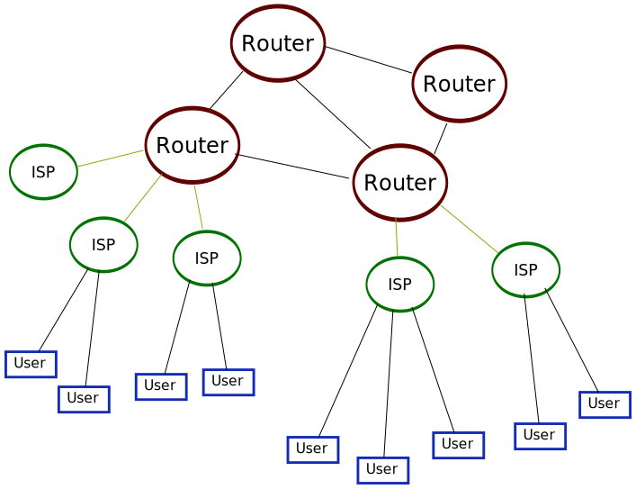
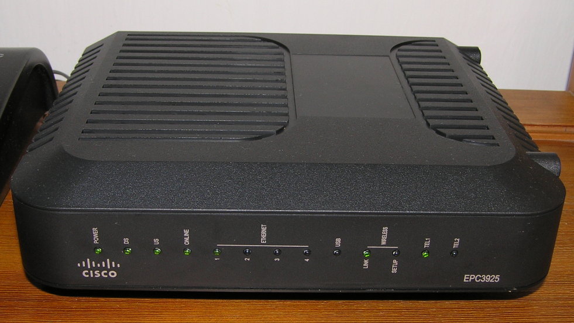
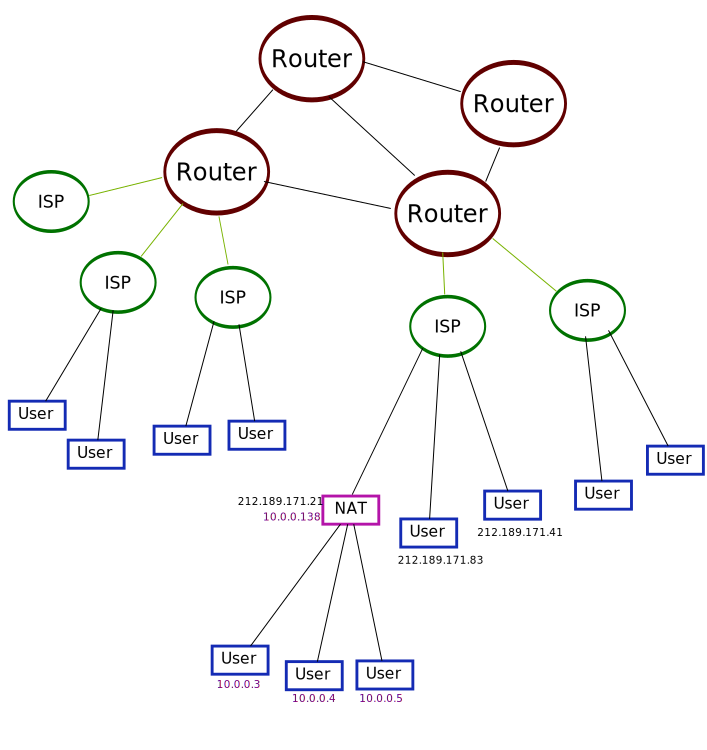

+++
title = "Intro to the Internet and current issues"
description = ""
date = 2014-11-09
+++


### Abstract
We discuss the general idea of communication between computers, the structure
of the internet and some issues with the current structure.

### Information delivery between computers

Assume that there many computers, and we want them to be able to communicate
somehow with each other. Maybe from a human point of view, there are many human
beings in different locations, and they all have computers. Then those human
beings want to communicate somehow, effectively, using those computers.

The simple thing to do would be to connect those computers to each other, using
wires or some kind of wireless setting. Though it seems like whatever way we
pick, To connect every two computers we have to do some kind of work. If they
are very far geographically, it would be harder. We might need a very long
wire, or a way to create a very strong signal. 

We could also use some kind of an intermediate entity to transfer information
between two computers. It could be a satellite, or a big tower retransmits
information to long distances. However if do that, somebody has manage the
creation of those entities, and everyone else will have to pay to maintain it,
somehow. This setting can work, however there are a few reasons for which it
might not be the solution by its own.

### The Internet

The most famous solution to the question posed above is called the Internet. It
is a structure that connects many computers together, so that information could
be transferred from one computer to another, in a pretty simple fashion.
(A structure that connect many computers together is also called a network.)

For many, the idea of the Internet is some kind of mysterious thing. They think
about green numbers flying in the air, the cyberspace and other bombastic
words. Basically it is just a method for wiring many computers together, so
that routing information from a source to the destination is easy.

The internet is heirarchial. There are a few central computers that have the
sole job of routing information around. We call those routers. Then there are
some lower level routers that are connected to those routers. Finally the end
user of the internet connects to one of those low level routers. Those low
level routers in the end are sometimes called ISPs, or internet service
providers.




A Very simplistic view of the internet


Every computer on the network gets an address. In the Internet terms we call it
IP (Internet Protocol) address. This address somehow describes the location of
the computer in the Internet heirarchy of computers. Computers can't really
choose their address. Their addressed is assigned by a computer from the higher
heirarchy.

Whenever we want to send information from one computer to another, we first
have to know the address of the destination computer. Then we build a message
(It contains the destination address and some other information), and then we
pass it to the closest router. In turn, this router passes the message on to
the next router, and so on, until the destination is found.

How can routers know how to forward the message given only the address of the
destination? They use the heirarchial structure of the Internet. The address is
a description of where the destination is, inside this structure.

It is not very different than any other message delivery mechanism that the
human race has invented. If you think about it for a moment, the post office
(The offline post office) is not much different.

How can the post office send your letter to a given destination? If the
destination is in the same city, the local post office could do that. However
if the destination is in a different city, the letter will be passed to a
higher level post office. Finally if the destination is somewhere in another
country, the letter will be transferred to higher level post office, which will
then send the message to another high level post office on the destination
country. The phone system hierarchy is also not much different.

That said, there is much more to learn about how the internet works. There are
many tactical algorithms for making routing more efficient. (but this is
probably also true for post offices and phone companies), and also many more
protocols built upon the basic message delivery to make it more reliable.
(packages could be lost on the way, and we might need to deliver them again
etc.)

My main claim here though, is that the internet method of delivering messages
from a source to destination is dependant on the hierarchical structure of the
internet. There is no magic.

### Obstacles with the current method

I wouldn't bother telling you all that about the Internet without a point. I
want to discuss a few drawbacks of the currently used hierarchical method for
deliving information:

#### 1. The Addressing problem and NAT


##### More about Internet Addressing
As we mentioned above, every computer in the Internet is assigned a unique
address. This address somehow marks its location inside the hierarchical.

To be more specific, in the Internet every computer is assigned a number of
size 32 bits, or 4 bytes, according to the IPv4 protocol. This means that there
are about $2^{32} = 4294967296$ possible addresses for computers in the internet.

When the end user (It might be you) wants to join the internet, he first pays
for an account at some ISP (Internet Service Provider). You can think about ISP
as some low level router on the internet. Your computer is then directly
connected to the ISP. In fact, the ISP will be the only entity that your
computer is directly connected to.

The ISP is responsible for assigning an address to your computer, and also to
handle the routing of information from or to you computer. The ISP can't just
pick random addresses for end users, as there might be a collision with
another address on the internet. (Addresses should be unique). Therefore
there is a higher level division of the addresses between ISPs.

The IANA (Internet Assigned Numbers Authority) orginization is the top level
entity responsible for assigning addresses. Basically speaking, ISPs buy ranges
of addresses from IANA.

##### Shortage of Addresses
$2^{32}$ addresses is a pretty large amount, though if you consider it again
for a moment, you might find out that we could finish it pretty quickly.
To begin with, there are more people in the world than $2^{32}$. In addition,
we probably have more computers than people. It's not only the desktop
computers that need to have an address. It's also all the laptops, the
cellphones, the stoplights on the streets, and very soon your refrigirator.

One solution that was proposed was increasing the address space. It was
proposed in the IPv6 protocol (Together with other adjustments that we won't
discuss here). In the IPv6 protocol, every address is of size 128 bits (16
bytes). Just so that you get a prespective, $2^{128} =
340282366920938463463374607431768211456$. It's really a lot.

As IPv4 and IPv6 are not compatible, (and because of other reasons which are
probably related to human nature,) it is a difficult task to transition all the
computers connected to the internet to IPv6. 

##### The NAT idea
Meanwhile, other temporary solution was introduced. It is called NAT (Network
Address Translation). The basic idea behind NAT is to overcome the shortage of
IPv4 addresses by hiding many computers behind one address.

Imagine for example that your local post office doesn't want to give you a new
address, because there is a shortage of addresses in the world. If you really
want to get mail, you could just supply the address of your neighbour Joe, and ask
him to give you your mail. If other people on your block do the same and ask
Joe to recieve their mails, Joe becomes a NAT. (A human NAT).

Going back to the digital world, a NAT looks like a small box. You connect all
your computers to the NAT, and then you connect your NAT to the ISP. We say
that the computers in the internal part of the NAT are "behind the NAT".



A picture of a Cisco router. It probably has the NAT abilities.


To the outside internet, the NAT feels like one computer. It has one Internet
Address and it can receive or send messages.

Behind the NAT, every computer is assigned an internal address by the NAT.
Every computer from the internal part of the NAT can send a message to the
outside internet. Receiving messages is more difficult (Remember that this was
the original problem).

To recieve a message, a computer behind the NAT should arrange it with the NAT
first. (In real world words, the system administrator has to enter the
administration interface of the NAT and "forward a port"). Then whenever the
NAT receives a message, it checks if it is destined to one of the computers
behind the NAT. If it is, the NAT can forward the message to the apropriate
computer.



A general sketch of the network behind a NAT, and the external Internet

NATs have become very common these days, mostly because they quick solve the
address shortage problem without having to change the Internet itself. The NAT
actually fools the external network to think that it is one computer, and it
fools the computers behind the NAT to think that they are connected to the
real internet.

NATs are so common these days, that most likely you are behind a NAT right now.
Maybe behind even more than one NAT, so far from the "real" Internet.

<h5>Addressing issues</h5>

Why should you care about NATs? It seems that everything works pretty smoothly.
Your web browser works just fine, and all the websites load quickly. As a more
advanced user you can create a website and upload it to some hosting service. 

But let me tell you about the things that you can't do so easily. 

<h6>Problems with Self hosting</h6>
As a simple user, most likely you can't host a website on your own computer if
you are behind a NAT. If you own the NAT and you know some stuff, you could
configure it so that outside computers will be able to connect to your
computer, behind the NAT. But if you don't own that NAT, or you don't know much
about NATs, your computer is just a guest in the internet. Outside computers
can not connect it, it can only connect to remote hosts.

Just as an example, most likely you can't host a website on your cellphone.
That is because your cellphone is behind a NAT. The NAT belongs to the phone
company, and you have no control over it. You can connect to external computers
in the internet, however external computers can not connect to your cellphone.

Some of those issues were present even before the NAT. If you want to host a
website on your own computer, you will need some kind of permanent Address, so
that surferes can get to your website. You will need a permanent IP Address. If
you are connected to the Internet as a usual end user, most likely your ISP
assigns you a random IP address from the range of addresses it owns. As this
address changes every once in a while, you can not rely on it.

To have real independence you will have to buy an IP address of your own and
some direct connection to the internet.

###### Issues with finding your own address
If your computer is behind a NAT, he can not know is own address. If you try to
check your own address it is very likely that it will be something like
192.168.x.y, or 10.0.0.x. This is an internal address, assigned to you by your
NAT. 

You can check it on your own computer.
On a windows box, enter at the command line:

```bash
ipconfig
```

On a Linux box, enter at the terminal:

```bash
ifconfig
```


Here is the output on my linux computer:

```bash
[real@freedom:~]$ ifconfig
eth0      Link encap:Ethernet  HWaddr f4:6d:04:0e:8b:89  
          inet addr:10.0.0.9  Bcast:10.0.0.255  Mask:255.255.255.0
          inet6 addr: fe80::f66d:4ff:fe0e:8b89/64 Scope:Link
          UP BROADCAST RUNNING MULTICAST  MTU:1500  Metric:1
          RX packets:7838193 errors:0 dropped:0 overruns:0 frame:0
          TX packets:5607954 errors:0 dropped:0 overruns:0 carrier:0
          collisions:0 txqueuelen:1000 
          RX bytes:9336295938 (9.3 GB)  TX bytes:850374026 (850.3 MB)

lo        Link encap:Local Loopback  
          inet addr:127.0.0.1  Mask:255.0.0.0
          inet6 addr: ::1/128 Scope:Host
          UP LOOPBACK RUNNING  MTU:65536  Metric:1
          RX packets:214589 errors:0 dropped:0 overruns:0 frame:0
          TX packets:214589 errors:0 dropped:0 overruns:0 carrier:0
          collisions:0 txqueuelen:0 
          RX bytes:23187729 (23.1 MB)  TX bytes:23187729 (23.1 MB)
```

As you can see, my address is 10.0.0.9. This is an internal address given to my
computer by the NAT. My computer doesn't really know how to introduce himself
to the global Internet.

If you still want to know your global address, you could ask an external
computer. It's one of those cases in which to know who you are you have to ask
someone else. An example for IP discovery service is
[whatismyip](http://whatismyip.com). You can try it to find out your own IP
address.

While still possible, it could be a real pain to find your own address. You
have to trust some remote computer to find it out and send it to you. As an
example - If you and a friend are on two remote computers, each behind a NAT,
you can't initiate any communication without first finding out your "real"
addresses.

You might be wondering why can't the NAT tell you your address. After all, the
NAT is directly connected to the Internet, and he knows his own address. Many
NATs could tell you your address, however each NAT will do it in its own way.
Therefore you can not rely on a single way to find your address. (In other
words, there is no agreed upon API to ask for your address).

In other cases you might be behind two NATs. Then only the external NAT knows
his own address, while the internal one doesn't.

#### 2. Operator's Greed

Some think about the Internet as an ad-hoc distributed network of computers,
not controlled by anybody. (By now you probably know that it doesn't work this
way). At the same time, as an Internet user you must know that being connected
to the Internet costs money.

You might be wondering where this money ends up eventually. You pay the money
directly to the ISP. The ISP uses the money to maintain the structure (For
example, the wires that connect you to the ISP), to buy IP addresses from IANA
and to pay other expenses and salaries.

The ISP and also other central entities on the chain of hierarchy could charge
more money, and in most cases as the end user you will have to comply. 

You could get away by changing your ISP, but you can't move to another IANA for
example. There is only one IANA. You can't get away from paying for an IP
address.


Other things that you will have to deal with as an end user is the bandwidth
allocation (You are only allowed to send/receive so much data per second to the
internet through your ISP). There is some logic behind this limitation. If
too many users of the internet will send lots of data at the same time, it will
harm the Internet experience of other users. However, in some cases the speed
limitation is arbitrary, and is related to pricing strategies. 

Another thing is that many of the Internet users are not very tech savvy. ISPs
sometimes come up with strange schemes to make more money. Lately I also heard
of some ISPs that plan on breaking the [net
neutrality](http://en.wikipedia.org/wiki/Net_neutrality) by blocking some
websites and slowing down others. Website owners that want to keep their
website accessible will have to pay those ISPs.

I do not claim that I know the real costs and expenses of managing an ISP,
though I do claim that from the position of ISP owners (Or other entities on
the hierarchy) it is very tempting to try making more money in questionable
ways.

#### 3. Privacy and Censorship

Being connected to the internet as an end user, you are connected directly to
your ISP. That means that every information you send or receive is routed
directly through your ISP. Your ISP sees everything.

The ISP could save any suspicious network activity for later use, or even block
certain websites that your government don't want you to visit. In some
countries in the world ISPs block and monitor much of the information end users
send or receive. See for example [The Golden Shield
project](http://en.wikipedia.org/wiki/Golden_Shield_Project) in China.

It is also hard to be anonymous in the Internet. To be connected, you have to
register with an ISP. Usually you will give the ISP your name and details. They
deliver communication to your home, so they also know where you live.

Some users use [Encryption](http://en.wikipedia.org/wiki/Encryption) to evade
snooping from the ISP's side, and also methods of data obfuscation or
steganographic channels to be able to access blocked websites and stay
anonymous online. (See for example the [tor
project](https://www.torproject.org/))

It's pretty much a constant silent war, where the ISP has the initial advantage
of access to the Internet.


### Final Summary
That was a **very** general summary of what is the internet, how it basically
works and what problem it tries to solve. We also pointed out some issues with
the current structure. Some of those issues arise from the hierarchical
structure of the Internet.
