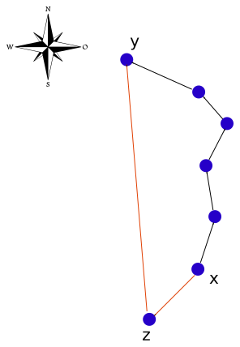
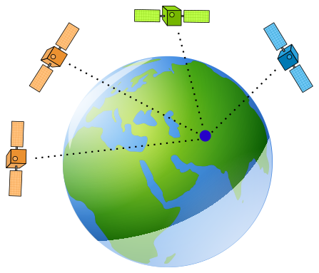
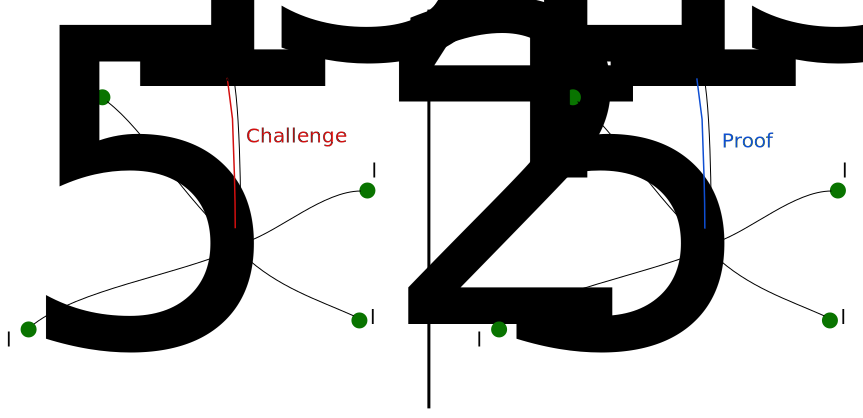
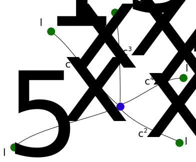
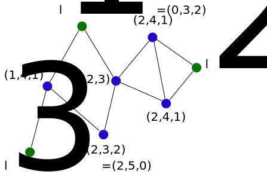

+++
title = "Landmarks Navigation by Random Walking"
description = ""
date = 2014-12-23
+++

<!--
abs function.
-->
$$
\newcommand{\abs}[1]{\left|{#1}\right|}
\newcommand{\paren}[1]{\left({#1}\right)}
$$

<h4>Abstract</h4>

We introduce the Network Coordinates: A dynamic method for assigning addresses
for nodes in a distributed mesh network. We show some properties of the Network
Coordinates. In particular, the Network Coordinates of adjacent nodes are
similar.

We create a random walking algorithm that is based on the information from the
Network Coordinates. We use this algorithm to route messages from a source node
to a destination node in the network. 

Next, we run some [code experiments
[github]](https://github.com/realcr/freedomlayer_code/tree/master/landmarks_navigation_rw)
to check the performance of the random walk algorithm. Our results show that
this method of routing works for networks up to size of $2^{15}$ nodes. It
will probably not scale well for much larger networks.

We conjecture that there exists a more efficient decentralized algorithm that
relies on Network Coordinates to route messages in a mesh network.

<h4>Motivation</h4>

Given a mesh network, we want to be able to send a message between two
arbitrary nodes. We have already presented several possible solutions:
[flooding](http://en.wikipedia.org/wiki/Flooding_%28computer_networking%29),
[$\sqrt{n}$ mesh
routing](./research/sqrt_n_routing/index.md), [Virtual
DHT routing](./research/exp_virtual_dht_routing/index.md)
and the [Distributed Post
Office](./research/dist_post_office/index.md).

We can look at this question from another perspective: How can
a message inside the network navigate itself to a given destination?

<h5>The Global Positioning System</h5>
As human beings, the modern way of navigating oneself around the surface of the
planet is using the [Global Positioning
System](http://en.wikipedia.org/wiki/Global_Positioning_System), also known as
GPS. It works pretty well, and one might wonder why not apply it to messages
that travel inside mesh networks.

Some objections to use GPS to route messages in a mesh network might be as
follows:

- Having a GPS receiver on a node might require extra hardware setup and cost.

- Being dependent on GPS coordinates for message routing means being dependent
  on a system of satellites on the sky. (If someone can take those satellites
  down, he can take down our mesh network).

- GPS coordinates might not be so accurate, so we might have to complement the
  GPS navigation with some other routing algorithm whenever the message gets
  close enough to the destination.

- The loss of Anonymity: If a node's address is his GPS coordinates, it is easy
  to find his location geographically. (There might be a way around this
though).

But even ignoring all the objections mentioned above, there is still one more
thing to consider. Navigating using GPS coordinates inside a mesh network has
an inherent theoretical flaw.

While the GPS system encapsulates a "good understanding" of physical location on
the Earth surface, generally it will not have a "good understanding" of the
mesh network layout. Put in other words: **Two network nodes that are connected
by a direct network link might be very distant geographically**, and thus have
very different GPS coordinates.

Work done by Jon Kleinberg, ["The Small-World Phenomenon: An
Algorithmic Perspective"](http://www.cs.cornell.edu/home/kleinber/swn.pdf),
puts this idea into a more formal argument. Kleinberg's work hints that
navigation in a mesh using GPS coordinates can work efficiently only when the
network links are configured in a specific way. (If a link between every
two nodes $x,y$ exists with probability proportional to the inverse square
geographical distance between $x$ and $y$).

In simpler words, routing algorithms that rely on GPS coordinates will not make
good use of long links between distant nodes, unless those links show up in some
specific probability. (Don't let this make you skip the Small-World paper though :) )

We don't know if this specific configuration happens in real mesh networks, but
it seems to be very specific, so we will assume that generally it doesn't
happen for the rest of this text.

In the picture: $x$ routes a message to $y$ using GPS coordinates. As $y$
is at the north, it seems reasonable to route the message to northern nodes.
However, it turns out that a faster path is possible if $x$ would send the
message to $z$ at the south, which has a direct link to the destination node
$y$.

Using only knowledge from GPS coordinates, $x$ won't be able to guess that.

Despite the flaws in GPS based routing, there is still something very
attractive about it. Routing a message in a mesh network is hard because every
node has only local knowledge of the network, which doesn't give much
information about the network's structure as a whole. 
GPS gives us some approximation (although very incomplete) about
where we are in the network: It gives us some kind of "global information",
something that could not be trivially achieved in a distributed mesh network.

We might be able to reproduce the effect we get from GPS using some other
means. We begin by understanding how GPS works. 

<h5>How Positioning Systems work?</h5>

Described very roughly, the GPS system is based on a set of human made satellites
around earth. The satellites where positioned in a way that makes sure in every
time and place on earth, one can receive signal from a few of them. In order to
find out where you are on earth, you should receive signal from a few
satellites and find out how far you are from those satellites. Using the
obtained set of distances (And some information about current time and course
of those satellites), you can calculate where you are.

A very schematic illustration of finding location by data from a few
satellites.

The navigators of old used [Celestial
Navigation](http://en.wikipedia.org/wiki/Celestial_navigation) to find their
way using the stars. They looked at the stars and concluded information about
their location or direction. (Instead of measuring distance and time, they used
angular measurements).

An interesting thing to note is that in order to allow the navigation,  both
the satellites and the stars don't have to do much or be very smart. The
satellites transmit data continuously, and the stars always shine.

We might be able to make our own system of "satellites" or "stars" inside our
network, to allow messages find their way in the network.

<h4>The Network Coordinates</h4>

<h5>The Landmarks</h5>

In the end of [The Distributed Post
Office](./research/dist_post_office/index.md) article
we mentioned the idea of
Landmarks. Given a network of $n$ nodes, we choose a set of $k$ nodes to be
landmarks: $\{l_1,l_2,\dots,l_k\}$. (Those are just regular nodes that were
given the "Landmark" title.) Every node $x$ in the network remembers
a shortest path to each of the landmarks.

Let's assume that every node in the network has generated a key-pair of [public
key and private key](http://en.wikipedia.org/wiki/Public-key_cryptography). We
also assume that every node in the network knows a list of all the landmarks'
public keys. Every node that is a landmark would be able to prove it, by proving
that he owns his public key.

We currently do not discuss the method used to choose the set of landmarks.
Instead we will assume that it was chosen randomly somehow ahead of time. This
will be discussed in the future. (We showed one method to do this in "The
Distributed Post Office": Choosing the nodes that maximize the value of some
cryptographic hash functions)

We also do not discuss the value we pick for $k$. Currently you may assume
that we pick $k$ to be of some
[poly-logarithmic](http://en.wikipedia.org/wiki/Polylogarithmic_function) size
with respect to $n$.

<h5>Maintaining contact with the Landmarks</h5>

We begin by describing how each node $x$ in the network obtains a shortest
path to each of the landmarks: This is done by a few iterations where every
node in the network exchanges information with his immediate neighbours.

Find Shortest Paths (for node $x$):

- Every few seconds:
    - Send to all immediate neighbours the shortest path known to landmark
      $l_j$ for each $1 \leq j \leq k$.

- On receival of a set of paths:
    - Update shortest paths to $l_j$ for each $1 \leq j \leq k$ accordingly.

As shown in "The Distributed Post Office", this algorithm will calculate
shortest paths from every node $x$ to all the landmarks in at most $d$
iterations, where $d$ is the
[diameter](http://en.wikipedia.org/wiki/Distance_%28graph_theory%29) of the
network. Note that we don't need to know the exact value of $d$, because the
"Find Shortest Paths" algorithm keeps running as long as a node is in the
network.

Next, Every node $x$ should verify periodically that his paths to the
landmarks are alive. Here is one way to do it: $x$ will periodically send a
message to each of the landmarks that asks them to prove their identity (The
message will be sent along the shortest path known to $x$). In return, the
landmarks will respond with a proof that they are alive.

$x$ sends a challenge message to one of the landmarks
($l_3$) through a shortest path. $x$ then waits for a proof of identity
from $l_3$. If no answer arrives, $x$ discards his shortest path to $l_3$
and finds another path.

$x$ does the same for all of the other landmarks.

This method works, but it puts a lot of load on the landmarks. From the point of
view of one landmark $l_j$, $l_j$ has to send proofs to all the nodes in the
network every period of time. Forget about this problem for a while. We will show how
to resolve it in the future.

We get that at all times, every node $x$ has a verified shortest path to each
of the landmarks in the network. $x$ can calculate his network distance from
each of the landmarks (It's the length of the shortest path to those landmarks).
We denote the list of distances of $x$ from each of the landmarks by

$$Coord(x) = (c_x^1,\dots,c_x^k) := (dist(x,l_1),\dots,dist(x,l_k))$$ 

and we call it **$x$'s network coordinate**.

The picture illustrates network coordinates. 
$x$ maintains a shorest path to each of the landmarks
$l_1,l_2,l_3,l_4,l_5$. The coordinate $c_x^j = dist(x,l_j)$ is the length
of the shortest path from $x$ to $l_j$ for some $1 \leq j \leq 5$.

<h5>Properties of the Network Coordinates</h5>

By our construction we get a network coordinate for every node in the network.
We note here a few properties of the network coordinates.

<h6>Coordinates of landmarks</h6>

The landmark $l_j$ will have a coordinate of the form:

$$(dist(l_j,l_1),\dots,dist(l_{j-1},l_j),0,dist(l_{j+1},l_j),\dots,dist(l_j,l_k)$$

That is because $dist(l_j,l_j) = 0$ (The network distance of $l_j$ from himself is
0$. 

In addition, note that if a node $x$ has some $0$ coordinate, than $x$ must be a
landmark. (If the $i$'s coordinate is $0$, then this is the $i$'s
landmark.)

<h6>Continuity</h6>

For every two immediate neighbours $x$ and $y$ in the network, we get that
$\left|c_x^j - c_y^j\right| \leq 1$ for every $1 \leq j \leq k$. (Whenever
we move to an adjacent node in the network, we change every entry in the network
coordinate by at most 1)

We can prove this [by
contradiction](http://en.wikipedia.org/wiki/Proof_by_contradiction). Assume
(Without loss of generality) that for some $j$ we get that $c_x^j - c_y^j
\geq 2$. This means that $dist(x,l_j) \geq 2 + dist(y,l_j)$: The shortest
path between $x$ and $l_j$ is two hops longer than the shortest path between
$y$ and $l_j$. 

Illustration of $c_x^j$ and $c_y^j$.

But $x$ and $y$ are neighbours, so $x$ could instead
use the following path to $l_j$: First move to $y$, and then continue using
the shortest path from $y$ to $l_j$, which is of length $dist(y,l_j)$. As
a result we get a path from $x$ to $l_j$ which is of total length
$dist(y,l_j) + 1$, $1$ hop shorter than the path we assumed is the shortest
from $x$ to $l_j$. This is a contradiction.

Therefore we conclude that for every two immediate neighbours $x,y$ in the
network, $\left|c_x^j - c_y^j\right| \leq 1$. We call this property **the
continuity of network coordinates.**

<h6>The triangle inequalities</h6>

The function $dist(x,y)$ calculates the length of a shortest path between two
nodes $x,y$ in the network. It satisfies a few properties for every $x,y,z$
nodes in the network:

- $dist(x,y) \geq 0$ (Non negativity)
- $dist(x,y) = 0$ if and only if $x=y$.
- $dist(x,y) = dist(y,x)$. (Symmetry)
- $dist(x,z) \leq dist(x,y) + dist(y,z)$ (The Triangle inequality).

Make sure that you understand why the first three are correct.

We now show why the fourth one: The Triangle inequality, is correct.
The length of the shortest path between $x$ and $y$ is $d(x,y)$. The
length of the shortest path between $y$ and $z$ is $d(y,z)$. We can always
concatenate those two paths to obtain a path between $x$ and $z$ that is of
length $d(x,y) + d(y,z)$. Therefore the shortest path between $x$ and $z$
is at most of length $d(x,y) + d(y,z)$.

The four properties of $dist$ mentioned above could be summarized by saying
that $dist$ is a
[metric](http://en.wikipedia.org/wiki/Metric_%28mathematics%29).

We use $dist$'s properties to conclude the following inequality about the network
coordinates: For every node $x$ and $1 \leq i,j \leq k$:

$$\left|c_x^i - c_x^j\right| \leq dist(l_i,l_j) \leq c_x^i + c_x^j$$

In particular, this means that not every coordinate is valid. Some combinations
of numbers can never form a network coordinate. (With respect to a given set of
landmarks and distances between landmarks).

Illustration of the triangle inequality for network
coordinates.

Proof: Recall that $c_x^i = dist(x,l_i)$, and $c_x^j = dist(x,l_j)$.
By the triangle inequality property of $dist$ we get that $dist(l_i,l_j) \leq
dist(x,l_i) + dist(x,l_j) = c_x^i + c_x^j$, which proves the right part of the
inequality.

For the left part of the inequality, note that by the triangle inequality
property of $dist$ we get that $dist(l_i,l_j) + dist(l_j,x) \geq
dist(l_i,x)$. Therefore $dist(l_i,l_j) \geq dist(l_i,x) - dist(l_j,x)$. In
the symmetric direction we will get that $dist(l_i,l_j) \geq dist(l_j,x) -
dist(l_i,x)$. We conclude that $dist(l_i,l_j) \geq \left|dist(l_i,x) -
dist(l_j,x)\right|$, which proves the left side of the inequality.

<h6>The Uniqueness question</h6>

Are network coordinates unique? 

Assume that $x$ and $y$ are two different nodes in the network. Is it
possible that $Coord(x) = Coord(y)$?

The answer is yes. It is possible to construct a network where $x,y$ are two
different nodes, but $Coord(x) = Coord(y)$.

Example of different nodes having the same network
coordinate. Blue dots are regular nodes. Green dots are landmarks. Note that
the network coordinate (2,4,1) shows up twice.

However, this case is not the common case. It turns out that in many networks
where $\paren{log{n}}^2$ landmarks are chosen randomly, nodes' coordinates are
unique. We observe this phenomenon later in our experiments. Note that at this
point we don't know of a formal explanation in favor of this phenomenon.

As an exercise, think about the case of two dimensional grid. How many landmarks
are needed to make sure that network coordinates are unique?

<h4>Navigation by Random Walking</h4>

By now we managed to set Network Coordinates for every node. We have seen that
those coordinates, as opposed to GPS Coordinates, have a "real understanding" of
the network's structure. (See for example the continuity property, which the GPS
coordinates lack). In particular, our new construction is not limited by the
[small-world impossibility
results](http://www.cs.cornell.edu/home/kleinber/swn.pdf) result.

That said, it is still not obvious how to use the Network Coordinates to route
messages in the network.

We present here a relatively naive message routing method that gives nice
results and demonstrates the usefulness of Network Coordinates. It is based on
[random walking](http://en.wikipedia.org/wiki/Random_walk). 

To rephrase our intentions: Given two arbitrary nodes $x$ and $y$, $x$
wants to send a message to $y$. For this purpose $x$ is given $y$'s
Network Coordinate $Coord(y)$. We show an algorithm for routing a message from
$x$ to $y$, given the knowledge of $Coord(y)$.

<h5>The Observable distance</h5>

Assume that a message is to be routed from $x$ to $y$. Also assume that the
current position of the message in the network is some node $q$. If we could
know $dist(q,y)$ for any intermediate $q$, we could easily route the message to
its destination $y$ using the following greedy algorithm: In every step pass
the message to the neighbour node with the smallest distance to the destination
$y$.

However, we probably don't have enough information to calculate $dist(q,y)$ for
every $q$ in the network. Instead, we might be able to calculate some
approximation to the $dist$ function.

Given two nodes $a,b$ in the network and a value $1 \leq j \leq k$, it is
true that:

$$ \abs{dist(a,l_j) - dist(b,l_j)} \leq dist(a,b) \leq dist(a,l_j) + dist(b,l_j)$$

This can be concluded from the triangle inequality for the metric $dist$, as
we demonstrated earlier.

Using the information from distances to all the landmarks we can further
conclude that:

$$ \max_{1 \leq j \leq k}\abs{dist(a,l_j) - dist(b,l_j)} \leq dist(a,b)
\leq \min_{1 \leq j \leq k}\paren{dist(a,l_j) + dist(b,l_j)}$$

We are more interested in the left part at this point. We call it the
Observable distance between the nodes $a$ and $b$. We denote it by:

$$odist(a,b) := \max_{1 \leq j \leq k}\abs{dist(a,l_j) - dist(b_l,j)}$$

As we have just seen, $odist(a,b) \leq dist(a,b)$ for every two nodes
$a,b$. 

We also emphasize that $odist(a,b)$ could be calculated just by
knowing the network coordinates of $a,b$.

$$odist(a,b) := \max_{1 \leq j \leq k}\abs{dist(a,l_j) -
    dist(b,l_j)} = \max_{1 \leq j \leq k}\abs{c_a^j - c_b^j}$$

Next, we prove some properties of $odist$. (Basically we are going to show
that $odist$ is some weaker notion of distance function. You can skip this if
you don't have the mood for the math. The rest of the text doesn't rely on
those results).

<h6>odist is a Pseudometric</h6>

we prove that $odist$ satisfies the following for every three nodes
$x,y,z$:

- $odist(x,y) \geq 0$ (Non negativity)
- $odist(x,x) = 0$ for every node x.
- $odist(x,y) = odist(y,x)$. (Symmetry)
- $odist(x,z) \leq odist(x,y) + odist(y,z)$ (The Triangle inequality).

This means that $odist$ is a [Pseudometric](http://en.wikipedia.org/wiki/Pseudometric_space).
Note that $odist$ is not a metric because as we have seen before, it is
possible that $odist(x,y) = 0$ but $x \neq y$. (Compare the conditions we
presented for $dist$ with those we presented here for $odist$).

Our plan to prove this is to first show that each of the functions
$odist_j(a,b) := \abs{dist(a,l_j) - dist(b,l_j)}$ (For $1 \leq j \leq
k$ are pseudometrics. 

Then we use the fact that a maximum of pseudometrics is also a pseudometric
(See a hint [here [Mathematics
StackExchange]](http://math.stackexchange.com/questions/1020808/maximum-of-two-metrics-is-a-metric)),
which will prove that $odist$ is a pseudo metric.

For some $1 \leq j \leq k$, we get that $odist_j(x,y) = \abs{dist(x,l_j) -
dist(y,l_j)} \geq 0$, and also that $odist_j(x,x) = \abs{dist(x,l_j) -
dist(x,l_j)} = 0$. To show the Symmetry property, we have that $odist_j(x,y)
= \abs{dist(x,l_j) - dist(y,l_j)} = \abs{dist(y,l_j) - dist(x,l_j)} =
odist_j(y,x)$.

We are left to show the triangle inequality for $odist_j$.
$$odist_j(x,z) = \abs{c_x^j - c_z^j}$$
$$odist_j(x,y) + odist_j(y,z) = \abs{c_x^j - c_y^j} + \abs{c_y^j -
c_z^j}$$

Assigning $x' = c_x^j, y' = c_y^j, z' = c_z^j$ we are left to prove:

$$odist_j(x,z) = \abs{x' - z'} \leq \abs{x' - y'} + \abs{y' - z'} =
odist_j(x,y) + odist_j(y,z)$$

But $\abs{x' - z'} = \abs{(x' - y') + (y' - z')} \leq \abs{x' - y'} +
\abs{y' - z'}$. So we proved the triangle inequality for $odist_j$.

As $odist(x,y) = \max_{1 \leq j \leq k}{odist_j(x,y)}$, we conclude that
$odist$ is a pseudometric.

<h6>odist with $A^*$</h6>

I deviate from our current track for a moment to show you another interesting
feature of the $odist$ function.

[$A^*$](http://en.wikipedia.org/wiki/A*_search_algorithm) (Pronounced A Star) is
a graph searching algorithm. Shortly described, it is an extension of Dijkstra
algorithm that uses heuristics to get better performance. A great explanation
of $A^*$ and graphs path-finding could be found
[here](http://www.redblobgames.com/pathfinding/a-star/introduction.html).

Please make sure you understand $A^*$ to some extent before you continue reading
this section.

While I don't know of a way to use the $A^*$ algorithm in a distributed manner
(which is also secure), it is still interesting to find out what is possible
with $A^*$, given the $odist$ function.

To use $A^*$, we need some [admissible heuristic
function](http://en.wikipedia.org/wiki/Admissible_heuristic) $h$. That means,
if we try to find a path from node $x$ to node $y$, we want some function
$h$ such that $h(q) \leq dist(q,y)$ for every node $q$.

It is also known that if we manage to find such function $h$ that is also
[consistent](http://en.wikipedia.org/wiki/Consistent_heuristic), we will be
able to invoke $A^*$ more efficiently. A consistent heuristic is a function
$h$ that satisfies $h(a) \leq dist(a,b) + h(b)$ for every two nodes
$a,b$.

Given a destination node $y$, we can define $h(q) := odist(q,y)$ to be our
heuristic function. We show that $h$ is an admissible consistent
heuristic function.

$h$ is admissible because $h(q) = odist(q,y) \leq dist(q,y)$.
To be prove that $h$ is consistent, we first note that by $odist$'s
triangle inequality property, we get:

$$h(a) - h(b) = odist(a,y) - odist(b,y) \leq odist(a,b) \leq dist(a,b)$$

Therefore $h(a) \leq dist(a,b) + h(b)$, which means that $h$ is consistent.

We showed that $h(q) := odist(q,y)$ is an admissible consistent heuristic.

<h5>Random walking</h5>

We want to send a message from some node $x$ to another node $y$ in the
network. We plan to let the message wander somewhat randomly around the
network, hoping that it will eventually find $y$.
Given that at the current step the message is located at some node $q$, in
the next step the message will be passed randomly to one of $q$'s neighbours.

Without further information about the location of $y$ and the current
location of the message inside the network, we couldn't expect this method to
yield any promising results. (The message might wander around and go through
almost all nodes before finding $y$). However, using the $odist$ function
we could get some approximation for how close we are to the destination node
$y$.

Assume that a message that is being sent from a source node $x$ to a destination node
$y$. Also assume that currently the message is located at some node $q$ in
the network. We describe here the algorithm used to pass the message to one of
$q$'s neighbours:

-   For each $r$ which is a neighbour of $q$:
    - Calculate the weight $w_r = {\beta}^{odist(q,y) - odist(r,y)}$

-   Calculate $w = \sum_{r}{w_r}$, the sum of all weights.
    
-   Pass the message to a random neighbour of $q$, where every neighbour $r$
    is chosen with probability $\frac{w_r}{w}$.

Some notes about neighbour's probabilities:

-   We pick $\beta$ to be some number bigger than 1. You can imagine that $\beta
    = 2$. In our experiments later we pick $\beta = 22$.

-   The more a neighbour of $q$ is close to $y$, the more likely it is that
    we choose to pass the message to that neighbour.

-   We divide by $w$ to normalize the weights $w_r$ into a [probability
    vector](http://en.wikipedia.org/wiki/Probability_vector).

-   Because of the continuity property of the coordinates, we can conclude that
    $odist(q,y) - odist(r,y) \in \{-1,0,1\}$. Therefore $w_r \in
    \{{\beta}^{-1},1,\beta\}$

<h5>Experiments results</h5>

I wrote some code to test the efficiency of message routing using random walk,
as described above. It is written in Python3, and relies on the networkx
library.

The code could be obtained [here
[github]](https://github.com/realcr/freedomlayer_code/tree/master/landmarks_navigation_rw)

If you want to run it, make sure that you have networkx installed. It could be
installed by running:

    :::
    pip install networkx

There are a few files in the landmarks_navigation_rw folder. The file
graph_coord.py is the main graph coordinates library. It contains GraphCoord
class, which is most of the logic. The other python files rely on
graph_coord.py, and they check different things.

<h6>Random Walking with odist</h6>

We begin with random_walk_odist.py. This program checks the performance of
random walking with odist.

We generate random
[Erdos-Renyi](http://en.wikipedia.org/wiki/Erd%C5%91s%E2%80%93R%C3%A9nyi_model)
networks of different sizes. We pick $n = 2^i$ to be the amount of nodes in the
network, and $p = \frac{2i}{2^{i}}$: the probability for an edge to exist. 
$k=i^2$ is the amount of landmarks. In other words, $k =
\paren{\log{n}}^2$. 

For the random walk we pick $\beta = 22$. Why $22$? It gave me good
results. You might find a better $\beta$ yourself. (Note that $\beta$ is
referred to as "base" inside the code.)

For every generated graph we simulate delivery of a few messages
using the random walk method.

These are the results: 

    :::
    Random walking using odist
    ---------------------------
    ||| graph generation func = gen_gnp_graph
    ||| i's range = range(6, 16)
    ||| num_messages = 32
    ||| base =  22

     i   | k      | Avg num hops    | Max Node Visits  | Max Coord Occur  
    ----------------------------------------------------------------------
       6 |     36 |        2.687500 |                5 |               1 
       7 |     49 |        3.031250 |                5 |               1 
       8 |     64 |        3.562500 |                4 |               1 
       9 |     81 |        5.781250 |                4 |               1 
      10 |    100 |       10.281250 |                6 |               1 
      11 |    121 |       15.437500 |                6 |               1 
      12 |    144 |       29.593750 |               12 |               1 
      13 |    169 |       34.531250 |                8 |               1 
      14 |    196 |       41.000000 |                7 |               1 
      15 |    225 |       53.593750 |                8 |               1 

How to read this output?

The first lines show the parameters chosen for this run. graph_generation_func
is the function used to generate the graph. We chose gen_gnp_graph, which is an
Erdos-Renyi random graph. (Other possibility is gen_grid_graph. You can try
it). $i$ is a parameter related to the amount of nodes in the network. As
noted above, $n = 2^{i}$. num_messages is the amount of messages we send to
approximate the average number of hops it takes for one message to get to its
destination. We chose 32.

Next, we have a table. Every row in this table represents the results for one
generated graph. We now explain every column in this table. $i$ is the
logarithm of the amount of nodes in the network. $k$ is the amount of
landmarks (Note that in this experiment, we chose $k = i^2$).

"Avg num hops" is the average number of hops it takes for a message to get to
its destination. This number is approximate. It is deduced by sending just a
few messages, and calculating an average for the amount of hops.

"Max Node Visits" counts the maximum amount of times a node was visited by
wandering messages. For example, if this column shows $5$, it means that
some node $q$ in the network has routed $5$ messages (Maybe even the same
message more than once), and no node in the network has routed more messages
than $5$.

"Max Coord Occur" counts the occurrences of the most common coordinate. If it is
$1$, it means that coordinates in the network are unique. If is is more than
$1$, it means that some coordinate in the network occurs more than once,
hence the network coordinates are not unique.

The first thing to observe about the results is the value of "Max Coord Occur".
It is always $1$ (At least until $i=15$). This means that the network
coordinates are unique. This is important: We can not expect to route
messages successfully if nodes' addresses aren't unique. 

If we pick $i=k$ the network coordinates will not be unique. If we pick
$i=k^{1.5}$ we sometimes get a $2$ at the "Max Coord Occur".

Next, it is interesting to look at "Avg num hops". It has some pretty small
values for $i \leq 10$, but it increases very fast. At $i=14$ we already
get a value of $68.9$. This is still practical, but at this growth rate when
we get to $i=40$ we expect to have a huge "Avg num hops". My guess is that
this method won't scale to very big networks.

Regarding "Max Node Visits": It looks like it somehow grows, but I didn't
manage to get any important conclusion from its values. I left it there because
you might have an idea.

<h6>Measuring network load</h6>

In the [Distributed Post
Office](./research/dist_post_office/index.md) we
managed to route messages very efficiently, however all the messages were
routed through a few specific nodes. This is unacceptable for large distributed
mesh networks.

We want to make sure that we managed to avoid this problem here. To measure the
load, we count the amount of messages that have passed through each of the
nodes in the network. Then we look at the nodes that routed the biggest amount
of messages.

For this run we generate a random network (Using the Erdos-Renyi model) of
size $i=14$ ($n=2^{i})$. We pick $p = \frac{2i}{2^{i}}$ to be the
probability of an edge to exist. The amount of landmarks is $k = i^{2}$, and
$\beta = 22$.

After the graph generation, we simulate the delivery of $4096$ messages. For
each node $x$ we count the amount of times a message has passed through
$x$. (Note that a message might pass more than once through $x$).

The relevant code is inside measure_load_odist.py. Here are the results:

    :::
    ||| graph generation func = gen_gnp_graph
    ||| i = 14
    ||| num_messages = 4096
    ||| base =  22

    Generating graph...
    Generating coordinates...
    Simulating messages delivery...

    most commonly visited nodes:

     node            | Times visited   
    -----------------------------------
     1689            |              51 
     15541           |              47 
     13284           |              45 
     11387           |              44 
     8423            |              43 
     4256            |              41 
     6428            |              41 
     5203            |              40 
     13389           |              40 
     15753           |              40 
     6618            |              39 
     999             |              37 
     7084            |              37 
     9790            |              37 
     12962           |              37 
     1308            |              36 
     1548            |              36 
     5301            |              36 
     5592            |              36 
     9701            |              36 
     16201           |              36 
     573             |              35 
     1339            |              35 
     2628            |              35 
     4451            |              35 
     4615            |              35 
     7415            |              35 
     7492            |              35 
     7720            |              35 
     10367           |              35 
     12390           |              35 
     12492           |              35 

The table shown in the output is the set of most commonly visited nodes. It
is ordered by the amount of visits.

The node column is the index of the node in the list of nodes inside the python
code. Times visited counts the amount of messages that have visited the
specific node.

None of the nodes you see in this table are landmark nodes. I know this because
if any of those nodes was a landmark, it was printed with two asterisks around
it. (See the source code for evidence). This means that the landmark nodes
aren't being visited more than usual nodes.

We can also see that some nodes are more visited than others, though it seems
like there is no specific set of nodes that routes most of the messages.

<h6>Naive random walking</h6>

If you are not sure that we gained anything by having the $odist$ function,
let me show you what happens when we perform a naive random walk, without
using the information from $odist$.

We use the same parameters from the "Random Walking with odist" section, except
for choosing $\beta = 1$. Recall that the weight for moving to a neighbour
$r$ in the random walk is $w_r = {\beta}^{odist(q,y) - odist(r,y)}$.
For $\beta = 1$ we always get $w_r = 1$, therefore all the neighbours will
have the same probability of being chosen.

The code is at random_walk_naive.py. These are the results:

    :::
    Naive random walking
    ---------------------------
    ||| graph generation func = gen_gnp_graph
    ||| i's range = range(6, 16)
    ||| num_messages = 32
    ||| base =  1

     i   | k      | Avg num hops    | Max Node Visits  | Max Coord Occur  
    ----------------------------------------------------------------------
       6 |     36 |       71.593750 |               59 |               1 
       7 |     49 |      172.187500 |              103 |               1 
       8 |     64 |      326.343750 |               82 |               1 
       9 |     81 |      449.625000 |               68 |               1 
      10 |    100 |      884.781250 |               61 |               1 
      11 |    121 |     2719.187500 |               85 |               1 
      12 |    144 |     3449.906250 |               58 |               1 
      13 |    169 |    10169.531250 |               88 |               1 
      14 |    196 |    18943.343750 |               82 |               1 
      15 |    225 |    36732.375000 |               78 |               1 

Note that the average amount of hops is much larger in this case. This means
that we do gain something by using the information from the $odist$ function.

<h4>Summary</h4>

We introduced a way to assign Coordinates to nodes in any mesh network. We call
these coordinates The Network Coordinates, and we use them as the network
addresses of nodes. The Network coordinates have some "understanding" of the
structure of the mesh network which we want to exploit to route messages in the
network.

We defined a function $odist$, which is used here as approximation of
the network distance function ($dist$). We also explored some other
interesting features of $odist$. The value $odist(x,y)$ could be calculated
just by knowing the coordinates of $x$ and $y$.

To route messages in the network we use random walking that takes into account
information from the $odist$ function: In every step, Nodes that are closer
to the destination are more likely to be chosen.

We ran the random walk algorithm and checked the results. It seems like the
random walk algorithm is practical for small networks (Probably up to
$n=2^{14}$). We don't know what happens for larger networks, but we
conjecture that the average amount of hops for message delivery becomes too
large.

<h4>Further thoughts</h4>

**The random walk method we used is pretty naive**. It was just a quick example of
what could be done with the Network Coordinates. Probably we can use the
Network Coordinates in a smarter way to route messages.

I suspect that routing messages using Network Coordinates on a two dimensional
grid graph should be easier than routing them on random Erdos-Renyi graph. This
is why all of the run results here deal with Erdos-Renyi graphs, which is the
harder case.

**Maintaining contact with the landmarks**: The network changes (Nodes join and
leave). Therefore every node $x$ in the network should verify that his
shortest path to each of the landmarks is still alive, and also that the
landmarks themselves are still alive. $x$ could periodically send a message
to each of the landmarks, and expect a response. This method puts great
load over the landmarks. There is a way to overcome this issue by combining all
the challenges and responses in the network. We will discuss it in the future.

About **choosing the Landmarks**: We have already presented in "The Distributed
Post Office" a method to pick landmarks (We pick the nodes that maximize some
cryptographic hash functions with their public key). However, an adversary
could craft special public keys that happen to maximize the hash values, and
thus he could take control over all the landmarks. One approach would be to
"mine" landmarks. All the nodes in the network will make effort to get higher
hash values. Assuming that the adversary is computationally limited, we assume
that he won't be able to gain control over most of the landmarks. This method
has the disadvantage of being computationally expensive.

A different approach to choosing landmarks would be to elect them. Every some
period of the time the landmarks will free some node from his landmark duty,
and elect a new landmark. 

