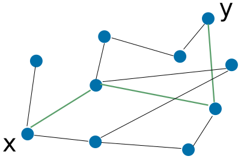
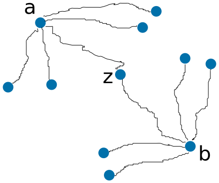
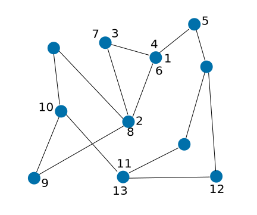
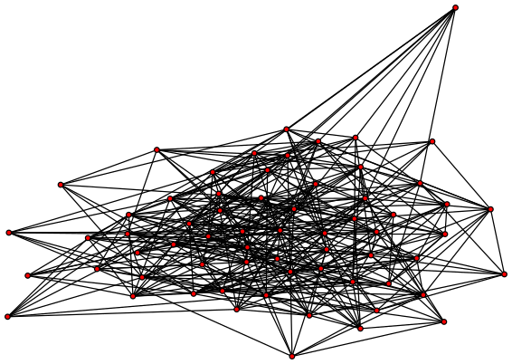
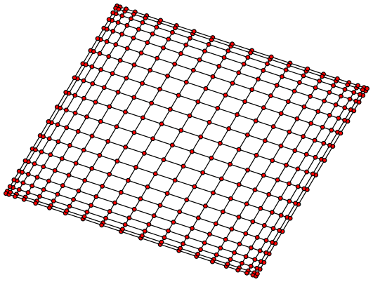

+++
title = "Sqrt(n) mesh routing"
description = ""
date = 2014-12-01
+++

<!--
ceil and floor latex macros:
-->
$$
\newcommand{\ceil}[1]{\left\lceil{#1}\right\rceil}
\newcommand{\floor}[1]{\left\lfloor{#1}\right\rfloor}
$$

<h4>Abstract</h4>

We introduce a message routing mechanism in which every node has to maintain
contact with a bit more than $\sqrt{n}$ random nodes in the network. Given
that set up, every two nodes can form a short communication path between them
that allows to send and receive messages. This mechanism is a bit more
efficient than flooding, but it is expected to work well only on some kinds of
networks.

This article was inspired by the ideas in [A sybil proof one hop
DHT](http://pdos.csail.mit.edu/papers/sybil-dht-socialnets08.pdf) by Chris
Lesniewski-Laas. 

<h4>The message routing problem</h4>

Assume that we have a set of $n$ correct nodes (No adversary). Each
node is directly connected to some other nodes (About $log(n)$ direct
connections). For a node $x$, we call every other node $y$ that is directly
connected to $x$ an immediate **neighbour** (We will sometimes write only
"neighbour").

Given two arbitrary nodes $a$ and $b$ in the network, we want to be able to
route a message from $a$ to $b$. As $a$ and $b$ are possibly not
neighbours, we might need to transfer the message through some intermediate
nodes until it finally reaches its destination, $b$.

In [The mesh question
article](./research/mesh_question/_index.md) we already
discussed the
[flooding](http://en.wikipedia.org/wiki/Flooding_%28computer_networking%29)
solution. We have seen that it works, but it is not very efficient: Every
message sent in the network has to pass through all the nodes in the network.

<h4>Virtual Neighbours</h4>

We noted above that in our network, every node $x$ has a small set of
immediate neighbours. We can extend this idea of neighbours by keeping contact
with farer nodes that are not necessarily immediate neighbours.

We say that a **path** is a consecutive set of connected nodes.
If a node $x$ knows a path to some other node $y$, $x$ could send
messages to $y$ through that path, assuming that all the nodes on that path
cooperate.

In the picture: Nodes are are blue points. Immediate links between nodes are
drawn as black lines. The green lines mark a chosen path of links between the
nodes $x$ and $y$.

It might be very likely that $y$ will want to send a message back to $x$.
(After all, they are having a conversation). In that case, $y$ will need to
know some path to send the message back to $x$. It could be exactly the same
path from $x$ to $y$ (But reversed), or some other path.

$x$ and $y$ will maintain contact by sending periodic
[heartbeats](http://en.wikipedia.org/wiki/Heartbeat_%28computing%29) to each
other, making sure that the remote side is alive. In that case we will say that
$x$ and $y$ are **virtual neighbours**. ($x$ is a virtual neighbour of
$y$, and vice versa).

The longer the path between $x$ and $y$, the harder it becomes for them to
stay in contact. That is because the link between $x$ and $y$ relies on all
the nodes on the path used between $x$ and $y$.

<h4>A Common Virtual Neighbour</h4>

Let's assume that every node in the network has some virtual neighbours.

In addition, let's imagine that somehow, every two nodes $a$ and $b$ in the
network have a virtual neighbour $z$ in common. In that case we can route
messages between any two nodes $a$ and $b$ in that network:

Assume that we are at node $a$, and we want to send a message to node $b$.
We first send a message to each of $a$'s virtual neighbours, asking them if
they know $b$ (As their virtual neighbour). One of $a$'s virtual
neighbours, $z$, should have $b$ as a virtual neighbour. Then we could send
a message to $z$, and $z$ will forward that message to $b$.

In the picture: $a$ and $b$ are two nodes in the network. The lines from
$a$ and $b$ are paths to virtual neighbours of $a$ and $b$. $z$ is
both a virtual neighbour of $a$ and a virtual neighbour of $b$. With the
help of $z$, $a$ and $b$ can communicate.

To make this solution valid, we have to make sure somehow that every two nodes
in the network have a virtual neighbour in common.

<h4>Using Random Virtual Neighbours</h4>

One simple approach would be to try randomize a set of virtual neighbours for
every node on the network, and hope for the best. We should still decide how
many virtual nodes every node is going to have, and how to randomize them.

Assume for a while that we do have a method of choosing a random virtual
neighbour. Given that ability, all that is left is to choose how many random
virtual neighbours every node will have. Knowing about the [birthday paradox](
http://en.wikipedia.org/wiki/Birthday_problem), we can assume that we are going
to need at least $\sqrt{n}$ virtual neighbours per node.

Assume that every node has a set of $r$ virtual neighbours. Let $a$ be some
node in the network, and we want to send a message from $a$ to $b$. What
are the odds of finding a path to $b$ using the random virtual
neighbours?

$a$ will ask each of his virtual neighbours if they know $b$. $a$ has
$r$ virtual neighbours, and each of those neighbours knows about $r$
virtual neighbours. The probability that some specific virtual neighbour of
$a$ doesn't know about $b$ is:

$$1 - \frac{r}{n}$$

Thus the probability that all of $a$'s virtual neighbours don't know $b$
is: 

$$p = \left(1 - \frac{r}{n}\right)^r \leq \left(e^{-\frac{r}{n}}\right)^r =
e^{\frac{-r^2}{n}}$$

The first inequality is derived from the inequality $1 + x \leq
e^x$.

We want to get a value for $p$ that is very close to $0$, and becomes
smaller as $n$ increases.
Choosing $r=\sqrt{n}$ will give us a constant bound over $p$, which is not
what we want. We should increase $r$ a bit. We could pick $r=\sqrt{n
\log{n}}$. In that case we get that $p \leq e^{\frac{-r^2}{n}} = e^{-\log{n}}
= \frac{1}{n}$, which is what we wanted.

We conclude that to be able to send a message from any node to any other node
in the network, it is enough to make sure that every node in the network
maintains $r = \sqrt{n \log{n}}$ randomly chosen virtual neighbours.

<h4>Randomizing Virtual Neighbours</h4>

As one of the nodes in the network, Getting random virtual neighbours is
nontrivial. This is mostly because a node in the network doesn't have a full
view of the network. He only knows about his immediate neighbours.

One approach to get a random virtual neighbour is **random walking**. Random
walking in a graph (Or a network) means that we begin from some node, and in
every iteration we pick a neighbour randomly, and move to that neighbour.

In the picture: An example for a random walk on a graph. Follow the numbers to
get a feeling of the random walk. (Begin from 1). Note that some vertices have
more than one number next to them. That is because the random walk has visited
those vertices more than once.

Can we really get to random nodes in the graph using this method? 
It turns out that if we walk a really long time on a graph, the [probability to
end up on a node is proportional to his graph
degree](http://www.cs.elte.hu/~lovasz/erdos.pdf). This is pretty random if most
nodes have the same amount of immediate neighbours.

Next, we want to figure out how many steps we should random walk before we get
close enough to the stated distribution. The amount of steps required is also
known as the [mixing
time](http://en.wikipedia.org/wiki/Markov_chain_mixing_time) of the system. 
 
For some graphs we will have to random walk for a very long time before we get
to somehow random nodes. In other words: Some graphs have a very large mixing
time. We will be generous and assume that our network has a small mixing time.
About $\log{n}$ steps. In another formulation, we will say that it is **Fast
Mixing**. How can we know that our network is really fast mixing? We don't
know, but we will assume it is for now, and see what we can do with it.

<h5>Getting Random nodes by random walking</h5>

Given the fast mixing assumption on our network, we can obtain random virtual
neighbours using the following method:

A node $x$ will generate a "random walking message" $m$. It will then
include his identity on the message, and send $m|x$ to one of his immediate
neighbours (He will pick one randomly). Assume that the immediate neighbour
$x_1$ was picked. $x_1$ will then forward the message to some random
immediate neighbour of his, $x_2$. $x_1$ will send $x_2$ the message
$m|x|x_1$. $x_2$ will send the message $m|x|x_1|x_2$ to a random
immediate neighbour of his, $x_3$, and so on.

The message forwarding will stop after $\log{n}$ iterations. (The message
contains the full path history, so it is possible to know the path length).
Then the last node that got the random walking message, $x_w$, will send a
message to $x$ along the reversed path. $x_w$ and $x$ will then become
virtual neighbours.

As we assume that the network is fast mixing, $x_w$ should be a random node
in the network, and therefore we found a way to get random virtual neighbours
for the node $x$.

$x$ will repeat the same process, to obtain a total of $r =
\sqrt{n\log{n}}$ virtual neighbours. $x$ will also have to maintain those
virtual neighbours by sending (and responding to) periodic heartbeats. If any
of those virtual neighbours fail, $x$ will find a new virtual neighbour.

<h5>Putting everything together</h5>

Let's review our full solution. Every node sends "random walk messages" to
obtain a total of $r = \sqrt{n\log{n}}$. Then whenever a node $a$ wants to
send a message to some other node $b$, $a$ will ask all of its virtual
neighbours if they have $b$ as a virtual neighbour. With high probability
(more than $1 - \frac{1}{n}$) one of $a$'s virtual neighbours, $x$, will have
$b$ as a virtual neighbour. Then $a$ already knows a path of nodes from
$a$ to $x$, and $x$ knows a path of nodes from $x$ to $b$. Using
information from $x$, $a$ could learn about a path from $a$ to $b$.
That path could be used to send messages between $a$ and $b$. Note that the
path between $a$ and $b$ will be of length about $2\cdot\log{n}$, which
is not very long.

<h4>Practicality questions</h4>

In the proposal above we get that every node has to maintain contact with about
$r = \sqrt{n\log{n}}$ virtual nodes. That means that every node $x$ in the
network has to receive and send heartbeats periodically to $r$ nodes.

In addition, whenever a node $a$ wants to set up a path to some other node
$b$, $a$ will first ask all of its $r$ virtual neighbours if they know
$a$. 

For big values of $n$, this could get impractical. For example,
If $n = 2^{40}$, we get that $r = 2^{20}\cdot 20 \approx 2^{24}$. Sending
$2^{24}$ messages to form connection with a remote node could be too much. In
addition, every node has to keep sending periodic heartbeats to his $2^{24}$
virtual neighbours. This could be expensive.

A further question might be regarding the fast mixing nature of networks. You
might be wondering if the network in our case is expected to be fast mixing.
(In other words - It has the property that random walks produce random nodes
pretty quickly). We don't have an exact answer for this one.

If our network looks like a [random
graph](http://en.wikipedia.org/wiki/Random_graph), we expect it to be fast
mixing. In addition, it seems like some researchers believe typical social
networks are fast mixing. (There are many articles about it, just search for
"social networks fast mixing" and see what you get). However, If our networks
looks like a grid (This could happen if we just connect close devices using
wireless), it is probably not very fast mixing.

In the picture: An
[Erdos-Renyi](http://en.wikipedia.org/wiki/Erd%C5%91s%E2%80%93R%C3%A9nyi_model)
random graph with $n=2^6$ and
$p=\frac{2\cdot 6}{2^6}$. This is an example of a fast mixing graph. You can
browse for the code [here
[github]](https://github.com/realcr/freedomlayer_code).

A grid is an example of a non fast mixing graph.

Going backwards a bit, why do we care at all about the network being fast
mixing? What if it is "slow mixing"? Couldn't we just use very long random
walks until we get a random node? The answer is that we could take longer
random walks, however the longer the path between a node $x$ and a virtual
node $y$, the less reliable the connection. We haven't considered adversarial
nodes in this case, but note that the longer the path, the more likely it is
that it contains some corrupt node that belongs to the adversary.

Longer paths also mean higher latency (It takes longer time to send and receive
messages), but we have more serious issues to care about at this point.

<h4>Summary</h4>
In a fast mixing network, given that every node maintains connections to $r
= \sqrt{n\log{n}}$ virtual nodes, every node $a$ in the network can form a short
path to any other node $b$. Using that path $a$ could send messages that
will arrive at $b$. Forming the path from $a$ to $b$ requires $a$ to
send about $r = \sqrt{n\log{n}}$ messages first, though.

This result might be enough for small networks, however for larger networks
This is not a very efficient result. It is better than flooding, though,  which
is a step forward.

As a note about further reading, the article [A sybil proof one hop
DHT](http://pdos.csail.mit.edu/papers/sybil-dht-socialnets08.pdf)
by Chris Lesniewski-Laas also talks about dealing with an adversary using the
scarcity of network connections (The adversary might find it difficult to get
links to many correct nodes), which is a pretty interesting idea.
