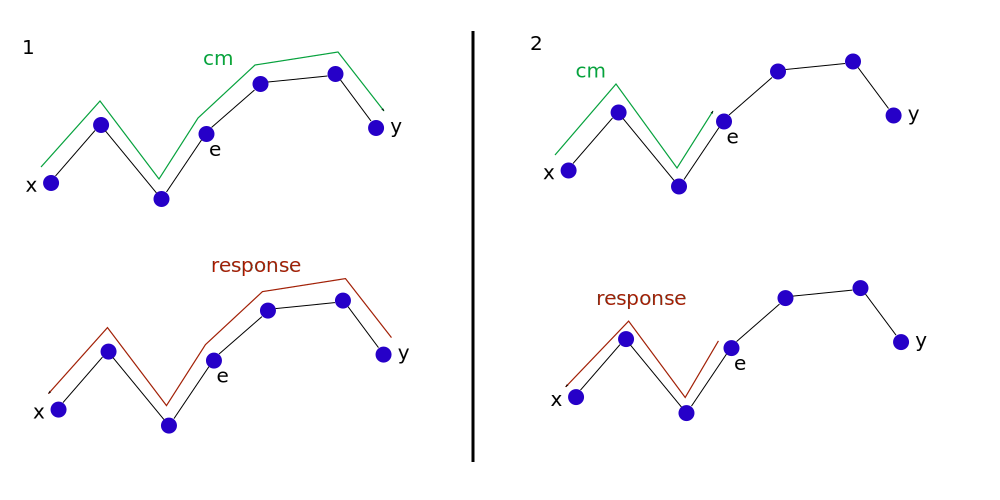
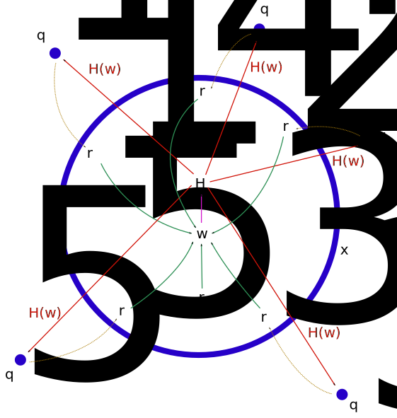

+++
title = "The Unified Challenge-Response: Secure Time inside the Mesh"
description = ""
date = 2014-12-31 
+++

<!--
abs function.
-->
$$
\newcommand{\paren}[1]{\left({#1}\right)}
$$

<h4>Abstract</h4>

Let $t$ be a specific node in a mesh network. Assume that every node $x$
knows the identity of $t$, and wants to verify that $t$ was recently alive. 
Also assume that $t$ has limited networking and computing power.

We review a few algorithms to solve this problem: Simple Challenge-Response,
Digital Signature over a counter and Digital Signature over a time stamp. We
then discuss the flaws of each of those algorithms.

Finally we present the Unified Challenge-Response: A distributed algorithm that
simulates time stamp using Cryptographic Hash functions and periodic randomly
generated numbers. By Signing the simulated time stamp and broadcasting it, the
node $t$ can prove that he was recently alive.

The size of the broadcasted message by $t$ in the naive solution is
$O(d\cdot s)$, where $d$ is the network diameter and $s$ is the amount of
immediate neighbours every node has. We mention two more improvements which
allow to reduce the size of the broadcasted message to $O(d\log{s})$ or to
$O(d)$.

<h4>Initial Ideas</h4>

<h5>The Challenge-Response</h5>

Let $x,y$ be two nodes in distributed mesh network. Assume that there is a
path of nodes between $x$ and $y$, known to $x$ and $y$. By a path we
mean that $x$ is an immediate neighbour of some other node $x_1$, which in
turn an immediate neighbour of some other node $x_2$ and so on, until we get
to some $x_k$, which is an immediate neighbour of $y$.

$x$ and $y$ are not immediate neighbours, however using the path between
them they can communicate.

As the network changes, the path between $x$ and $y$ might not last
forever. (One of the nodes one the path might fail). Moreover, one of the nodes
$x$ or $y$ might fail at some point. In a case of failure, the nodes $x$
and $y$ will want to be informed, so that they could find an alternative
path. (Or even just give up on the connection, in case one of them has failed).

A path between of nodes between $x$ and $y$. If any of the nodes along the
path fails, the communication between $x$ and $y$ will fail.

One idea would be that $x$ and $y$ will send periodic messages to
each other along the known path. Then if for example $x$ has not received a
message from $y$ for a long period of time, $x$ will assume that some node
along the path has failed, or $y$ itself has failed.

To make things a bit more secure we could use [public key
cryptography](http://en.wikipedia.org/wiki/Public-key_cryptography), with an
idea we call "challenge-response". $x$ will send a periodic message to $y$
(Along the path) which is a challenge to prove his identity. $y$ will respond
with a proof about his identity, sent along the path all the way to $x$.
Using public key cryptography we hope that $y$'s response could not be faked.

Note that the challenge sent by $x$ along the path to $y$ has to be a
different challenge every time. $x$ can not use the same challenge twice. The
next example explains why.

<h5>The Replay Attack</h5>

Consider the following case: $x$ and $y$ are connected by some path, and
$e$ is a node on the path between $x$ and $y$. Assume that $x$ sends a
challenge message $cm$ along the path to $y$. $e$ sees the messages
$cm$ and passes it to the next node on the path, until the message $cm$
arrives at $y$.

$y$ creates a proof for his identity with respect to the sent challenge. We
call this proof $pr$. $y$ then sends $pr$ along the path from $y$ to
$x$. $e$ will see $pr$, and pass it along to the next node on the path to
$x$.

Assume that $x$ now sends the same challenge $cm$ along the path to $y$.
Whenever the challenge $cm$ arrives at $e$, $e$ will not pass it to the
next node on the path to $y$. Instead, it will send back to $x$ the proof
message $pr$ that $y$ has generated in response to $cm$ the last time it
was sent.

$x$ will receive the message $pr$ which is a valid proof, and so $x$ will
incorrectly assume that $y$ has sent it. At this point $y$ might be already
dead, but $e$ could keep sending convincing messages to $x$ about $y$'s
existence.

In the picture: First (1), $x$ wants to verify that $y$ is alive. $x$ sends a
challenge message $cm$ to $y$ along the path between $x$ and $y$, and
$y$ sends back a response, proving that he is alive. Next (2), $x$ sends
again the same challenge to $y$, asking him to prove that he is alive. $e$,
which is a node in the middle of the path, doesn't forward $x$'s challenge to
$y$. Instead, it replays the last response sent by $y$, fooling $x$ to
believe that $y$ is alive.

This kind of attack, performed by $e$, is also known as [Replay
attack](http://en.wikipedia.org/wiki/Replay_attack). One way to avoid it is to
make sure that $x$ sends to $y$ a different challenge every time.

<h5>One to Many Challenge-Response</h5>

Assume that some node $t$ is a pretty important node in the network. It's so
important that every node $x$ in the network keeps a path to $t$. (An
example to this case could be found in [Landmarks Navigation by Random
Walking](@/research/landmarks_navigation_rw/index.md),
where $t$ might be one of the landmarks).

Note that this case is a bit different from the one described above. It
asymmetric. Every node remembers a path to $t$, but $t$ doesn't remember a
path to each node in the network. $t$ doesn't have the ability to do that, as
there are too many nodes in the network. Therefore we assume that every node
$x$ remembers a path to $t$, however $t$ doesn't know that path.

Every node $x$ that keeps a path to $t$ will want to know that $t$ is
still alive, and that his path to $t$ is still alive. 

<h5>Using simple challenge response</h5>

One idea to do that would be to use many instances of the challenge-response
method that was introduced earlier. Every node $x$ will periodically send a
message with a **unique** challenge along the path to $t$, then $t$ will
produce a proof and send a response message containing that proof somehow back
to $x$.

The main issue with this idea is that $t$ will have to generate proofs for
challenges sent from every node in the network. As noted above, $t$ does not
have the ability to do that, because there are too many nodes in the network.

<h5>Flooding a signed message</h5>

Instead of using the challenge response mechanism, $t$ could just flood the
network with a message signed by $t$'s key that says $t$ is alive.
The message will be something of the form: ("$t$ is alive", Signature by $t$).
(Note that the signature signs the content "$t$ is alive").

Recall what flooding means: Every node $x$ that receives such a message and
thinks it is valid will pass the message to all of its immediate neighbours.

This method is vulnerable to the Replay Attack: Let $e$ be some node in the
network. $e$ receives all the messages flooded from $t$. Therefore $e$
will obtain the message ("$t$ is alive", Signature) pretty soon.

Assume that after a while $t$ went offline. $e$ could then send the message
("$t$ is alive", Signature) again. This could trick all the nodes in the
network to believe that $t$ is still alive, although it is not online.

<h5>Flooding a signed message with a counter</h5>

To avoid the Replay attack introduced in the case of flooding signed message,
we could add something to $t$'s message which will make it a bit different
every time.

$t$ can include some kind of counter inside his messages, and
increase that counter by $1$ for every message sent. Then the message sent by
$t$ will look something like: ("$t$ is alive", counter = 345, Signature by
$t$), where the counter is increased for every message. (Note that the
signature signs the content and the counter together).

This time it is a bit harder for $e$ to replay $t$'s messages.
That is because the messages have a counter, and every node in the network
remembers the last counter value sent by $t$. If $e$ tries to replay some
message that was sent earlier by $t$, the nodes in the network will recognize
that the message is not recent, and they will not accept it.

Explained in some more detail: Assume that $t$ sends a periodic signed
message with a counter, stating that he is alive. An example for a sequence of
messages sent from $t$ would be: 

("$t$ is alive", counter = 103, Signature)

("$t$ is alive", counter = 104, Signature)

("$t$ is alive", counter = 105, Signature)

...

("$t$ is alive", counter = 171, Signature)

Recall that those messages have the purpose of proving to all the nodes in the
network that $t$ is still alive. 

After the last message sent by $t$, all the nodes in the network remember the
counter value $171$ for $t$'s sequence.

Let $e$ be some node in the network that receives those messages from $t$.
$e$ can try to send again one of $t$'s old messages. For example, the
message ("$t$ is alive",counter = 104,Signature). However, the nodes in the
network will not accept this message, because they know the current value of
the counter: 171. They know that the message with counter = 104 sent by $e$
is not new.

However, if $e$ is really determined to replay $t$'s messages, he can
wait longer. $e$ can wait until $t$ is offline, and then wait even more:
until all the nodes in the network have forgotten about $t$'s existence.

Why do we think that $t$ will eventually be forgotten? For every node $x$
in the network we assume that $x$ will forget $t$ at some point. That is
because it is not practical for $x$ to remember all the $t$-s of the past
together with their counter number forever. $x$ will have to delete some old
information, to make space for new information.

At the point where the information about $t$ was long forgotten, $e$ will
be able to replay all of $t$'s messages. $e$ could send all the messages
from the list above, one after the other, living the history of $t$ again.

<h5>Using a Time Stamp</h5>

We saw that adding a counter to the signed "alive" messages helps to deal with
replay attacks of the present, but it fails protecting against replay attacks
that take place in the far future.

To prove that a signed "alive" message was signed recently, we could add the
current time into the message, and sign it. A typical message would be:
("$t$ is alive", time="Sat Dec 27 09:38:58 UTC 2014",Signature), where the
signature is over the message's content and the time. This method to overcome
replay attacks is sometimes called a
[Timestamp](http://en.wikipedia.org/wiki/Timestamp).

Whenever a node $x$ receives an "alive" message, he will verify the signature
and check the time stated inside the message. If the time stated is very long
ago (Maybe a few minutes ago), $x$ will discard the message. Otherwise, if
the time is recent and the signature is valid, $x$ will know that $t$ is
alive.

In this case a node $e$ will not be able to replay an old "alive" message
sent by $t$. If $e$ wants to generate a valid "alive" message, he needs to
have a recent time stamp inside the message, together with a signature of $t$
over this message. Without cooperation from $t$, this would be computationally
infeasible for $e$.

There are some possible issues with this method, though.
First, we might not fully trust $t$. Maybe it is important for us that $t$
generates "alive" messages in real time, and doesn't make many of those
messages ahead of time for later use.

With the Time-stamping mechanism introduced above, $t$ could generate many
messages for the future ahead of time, signing over future timestamps. $t$
could then hand those future "alive" messages for someone else to deliver, in
the future.

The next issue is about time itself. **How can we get a definition of time
inside a distributed mesh network?** It seems to be a nontrivial question, both
because of relativistic time effects in distributed networks, and also because
we assume existence of some adversary players inside our network.

There are some solutions for this problem for the case of no adversaries or
weak adversaries. One thing you should probably check out is [Lamport
Timestamps](http://en.wikipedia.org/wiki/Lamport_timestamps).

I include here some naive approaches to get a mesh network definition of time,
and a short explanation of why they won't fit for our case:

-   We can set a special trusted node $TS$ (Time Server) that is responsible
    for advertising time. $TS$ will flood the network with a message about his
    current time every 1 second.

    The message sent by $TS$ will be of the form (current_time, Signature by
    $TS$).

    Then whenever $t$ wants to send an "alive" message, it will take the last
    message sent by $TS$, concatenate to that message the string "$t$ is alive"
    and add a signature over everything. The end result will be:
    ("$t$ is alive",(current_time,Signature by $TS$), Signature by $t$).
    (Note that using this method $t$ can not make "alive" messages ahead of
    time).

    To make this work we need some trusted node with some globally trusted key.
    This node has to live forever, or else the time in the network will "stop
    moving. This is probably unacceptable for most distributed network settings.

-   Every node will have its own clock, and nodes will fix drift by asking each
    other about the time. The time it takes a message to arrive can also be taken
    into account.

    This could probably work in a setting where we trust all the nodes to tell
    the truth about time. However, in the case of adversarial nodes inside the
    network, this will probably not work correctly.

<h4>The Unified Challenge-Response</h4>

Let $t$ be a specific node inside a mesh network. We are looking for a way to
let $t$ broadcast a signed message to all the nodes in the network, so that
every node will know that the message sent was signed recently, and thus $t$
was recently alive. 

We mentioned earlier two main ideas:

-   Challenge-Response: Every node $x$ sends a unique challenge to $t$, and
    $t$ responds with a proof. This proves to $x$ that $t$ is alive. We
    couldn't use this method because we can't afford letting $t$ generate
    proofs for challenges from all the nodes in the network.

-   Signing over some recent data: $t$ will sign some recent data, like the 
    current time, and broadcast it to all the nodes in the network. We couldn't
    use this method because we don't have a reliable and secure way to generate
    "recent data", like time.

The approach presented in this text is to somehow combine those two ideas
together. We will create something that we call the "Unified Challenge": A
challenge that will be created together by all the nodes in the network, in a
distributed and efficient fashion. 

This challenge will have somewhat similar role as the "current time" had in our
previous ideas. $t$ will sign the Unified challenge. Whenever a node
$x$ sees that unified challenge, he will be able to identify his own part
inside this challenge, thus $x$ will know that the message from $t$ is
recent, and hence $t$ was recently alive.

<h5>Combining Challenges</h5>

Recall how a simple
[challenge-response](http://en.wikipedia.org/wiki/Challenge%E2%80%93response_authentication)
mechanism works. $x$ sends $t$ some random number $r$ (Sometimes called
a [nonce](http://en.wikipedia.org/wiki/Cryptographic_nonce)). $t$
concatenates some value of its own $g$ to $r$, and then $t$ signs the
full message to obtain: (r,g,Signature by $t$). (The signature is over
(r,g)).

Side Note: If $t$ doesn't concatenate its own value $g$ to the response, $x$
could in fact ask $t$ to sign anything, which is not a good thing. Therefore
$t$ will add its own value $g$ before signing the message. You can think of
$g$ as some special constant.

A [Message sequence chart](http://en.wikipedia.org/wiki/Message_sequence_chart)
for a simple challenge response algorithm. $x$ sends $t$ a random number
$r$. $t$ generates a random number $g$, and then $t$ sends
(r,g,Signature by $t$), where the signature is over (r,g). Finally $x$
verifies the signature.

Observing this challenge-response process, we see that $x$'s challenge could
be determined by some random number $r$. In order to build a challenge that
combines are the challenges together, we should somehow combine all the numbers
$r$ from all the nodes in the network.

We use the following algorithm for each node $x$ in the network.
Assume that $x$ immediate neighbours are $q_1,\dots,q_s$. Also assume that
$H$ is some agreed upon [cryptographic hash
function](http://en.wikipedia.org/wiki/Cryptographic_hash_function).

Initialize:
    
- Initialize current Iteration Number $cit$ to be $0$ 
  (We use the concept of "Iteration Number" instead of a clock)

- For each neighbour $q_j$:
    - Set $r_j$ to be a random number.

Every few seconds: (Update Iteration)

-   Increase the current iteration number $cit$ by $1$. 

-   Generate a random number $r$.

-   Set $w := (r,r_1,\dots,r_{s})$. 

    In other words, we construct a string that contains all the random
    numbers, and includes the new random number $r$ that we have just
    generated.

-   for every $j$ between $1$ and $s$:

    - Remember $w$. (It can be forgotten after long enough time).
    In addition, remember the iteration number $it$ in which $w$ was
    generated.

    - Send $H(w)$ to $q_j$.

On receipt of message $m$ from neighbour $q_j$:

-   Set $r_j := m$.

A basic iteration for "combining challenges". The big blue circle is a
magnification of the node $x$ (So that you can see what $x$ does). The
nodes around: $q_1,q_2,q_3,q_4,q_5$ are $x$'s immediate neighbours. The
picture shows the flow of values. $r_1,\dots,r_5$ are obtained from messages
from the neighbours $q_1,\dots,q_5$. Then $x$ combines the values
$r,r_1,\dots,r_5$ to be $w$. Finally, the hash operation $H$ is performed
over $w$, and the result, $H(w)$, is sent to all the immediate neighbours
$q_1,\dots,q_5$.

Some Observations:

- The amount of traffic used: Every few seconds every node in the network sends
  to all his neighbours data of constant size.

- Memory usage: The node $x$ should remember the value
  $w$ for every Update Iteration. We may assume that $x$ keeps track of the
  last $1024$ values of $w$ generated. Whenever new values of $w$ are
  generated, the old ones can be forgotten.

- Assuming that the network is connected, after a while, every value $w$
  generated by a node $x$ depends on all the random numbers from all the nodes
  in the network. To be more precise, for this to happen, we need at most $d$
  update iterations, where $d$ is the
  [diameter](http://en.wikipedia.org/wiki/Distance_%28graph_theory%29) of the
  network. ($d$ is the biggest distance possible between two nodes in the
  network).

Further explanation for the last observation: Consider a new calculated $w$
value of some node $x$ at the network. $w$ depends on the newly generated
random value $r$ of $x$, and on all the $w$ values from all of $x$'s
neighbours. Consider some value $w$ that was accepted from a neighbour $q$
of $w$. $w$ depends on the random value $r$ generated by $q$, and also
on all the $w$ values accepted from all the neighbours of $q$. We can keep
going until we get that the original value $w$ we discussed depends on random
values $r$ generated by all the nodes in the network.

In the picture: Illustration of the dependence of $H(w)$ on values $r$
generated by all nodes in the network.

We denote by $w_x$ the value $w$ calculated by the node $x$, and by
$r_x$ the random value $r$ generated by $x$.

This is an example of a small graph of $5$ nodes, and the structure of
$w_x$ calculated by $x$. On the first level, $x$ depends on $r_x$ and
on values from the neighbours $y_2$ and $y_3$. On the next level, we can
see dependence on all the values $r_x,r_{y_1},r_{y_2},r_{y_3},r_{y_4}$.

Side note: The value $r_x$ on the first level might be different from the
value $r_x$ on the last level. $x$ might have generated a new random value
$r$ by that time.

<h5>Building the Response</h5>

Let $t$ be a node in the network. $t$ wants to broadcast a proof of being
alive to all the nodes in the network.

This will be done as follows: $t$ will take its current value $w_0 = w$ and sign
it. The full message $t$ generates is: ("$t$ is alive",$w_0$, Signature by
$t$).  (The signature by $t$ is over the content and over the
value $w$). This message will be sent to all of $t$'s immediate neighbours.  

In some sense, the value $w_0$ replaces the time stamp that we used in
previous solution proposals.

We describe here the verification algorithm for any node $x$ in the network
that receives such a message. 

On receipt of a message of the form: ("$t$ is alive",$w_0$,Signature by $t$,
$w_1,\dots,w_p$):

(Note: This message has probably gone through a path of $p$ nodes before $x$
has received it.)

-   Verify $t$'s signature. If it is invalid, discard the message.

-   Look for some record of $w$ in the past such that $H(w)$ is inside
    $w_p$. We call this record $rc$. If there is no such record, discard this
    message.
  
    Let $it$ be the iteration number in which $w$ was generated.

-   Verify that $H(w_i)$ is inside $H(w_{i-1})$ for every $1 \leq i \leq p$.
    If not, discard the message.

-   Accept the message. $x$ will conclude that $t$ was alive at time $dt$.

-   Check if the record $rc$ contains $t$ (That means we already know that
    $t$ was alive at iteration number $it$). If $rc$ doesn't contain $t$:

    (Note that we do this check to avoid loops in the flooding algorithm)

    -   Add $t$ to the record $rc$.
        This has the meaning of remembering $t$ was alive "after iteration
        $it$".

    -   Set $w_{p+1} := w$. Send the following message to all the neighbours:
        ("$t$ is alive", $w_0$, Signature by $t$, $w_1,\dots,w_p,w_{p+1}$)

We call the complete procedure described here (creating a combined challenge
from all the network nodes followed by verifying $t$'s "alive" message) the
**Unified Challenge-Response mechanism**.

<h5>The security of the Unified Challenge-Response</h5>

We want to show that it is hard to forge a "proof of being alive" for node
$t$ without knowing $t$'s private key.

Our assumptions over the adversary: The adversary is computationally bounded
(Can not forge a signature or invert a hash function), and has control over
some nodes inside the network. We call the nodes under the control of the
adversary the "corrupt" nodes. We call the rest of the nodes the "correct"
nodes.

We assume that if we discard the set of corrupt nodes, the network
will still be connected. In a different formulation: We assume that there is a
path between every two correct nodes that doesn't go through a corrupt node.

We first note that given the algorithm we described, $t$'s messages will
arrive at all the correct nodes in the network. That is because for every
correct node $x$ there is a path between $t$ and $x$ that doesn't go
through a corrupt node. (Note that we also assume here that $t$ is correct).

Illustration: A path of correct nodes between $t$ and $x$. $t$'s messages
will arrive at $x$. The blue nodes are correct nodes. The purple nodes are
corrupt nodes.

Next, we want to show that if a node $x$ receives and accepts a message of
the form ("$t$ is alive",$w_0$, Signature by $t$, $w_1,\dots,w_p$), it
means that with high probability $t$ was alive after a specific iteration
$it$ of $x$.

As we assumed the adversary is computationally bounded, he can not forge the
first part of the message: ["$t$ is alive",$w_0$,Signature by $t$].
We conclude that the first part of the message was created by $t$, and that
$w_0$ was the value of $t$'s $w$ at the time of the message creation. In
other words: $t$ was alive after the value $w_0$ was computed.

Next, as the message is accepted by $x$, it must be true that $H(w_1)$ is
inside $w_0$. We assumed that with high probability the adversary can not
invert cryptographic hash functions, therefore the value $H(w_1)$ was
generated using the contents of $w_1$.

Generally for every $1 \leq i \leq p$ we find that the value $H(w_i)$ was
generated relying on the contents of $w_i$. As $w_{i-1}$ contains
$H(w_i)$, we conclude that $w_{i-1}$ was computed only after $w_i$ was
computed.

Therefore we find that $t$ was alive after the value $w_p$ was computed.
$x$ knows of a record $rc$ that contains $w$ such that $H(w)$ is inside
$w_p$. That means that $t$ was alive after the record $rc$ was generated.
$rc$ was generated at iteration $it$ of $x$. Therefore $x$
knows that with high probability $t$ was alive after iteration $it$.

<h5>Shorter Messages</h5>

If every node in the network has many immediate neighbours, the broadcasted
messages from $t$ of the form ("$t$ is alive",$w_0$, Signature by $t$,
$w_1,\dots,w_p$) could become large.

Assuming that the size of a signature or a hash value is $b$ and that every
node in the network has $s$ immediate neighbours, we get that $w_i$ is of
size $b\cdot s$ for every $0 \leq i \leq p$. It means that a message from
$t$ could grow to a total size of $d\cdot b \cdot s$, where $d$ is the
diameter of the network.

In our current algorithm every node $x$ combines all the values $r_i$ from his
neighbours together with his randomly generated value $r$ into one new value
$H(w)$, where $w = (r,r_1,\dots,r_s)$. $w$ is kept for later use, **as
a proof** that the value $H(w)$ was calculated after the values
$r,r_1,\dots,r_s$.

We might be able to combine the values $r,r_1,\dots,r_s$ into a new value
$g$ using a different method. Without getting into too much details, I
present here two methods in which we could obtain much shorter proofs.

One method would be to use a [Merkle Tree](http://en.wikipedia.org/wiki/Merkle_tree).
Using this method $g$ will still have a constant size, however a proof that
$g$ depends on some $r_i$ will be of size $c\cdot\log{s}$ instead of
$c\cdot s$. This could be done by using .

We could become even more efficient, and get a proof of size $O(1)$ using
constant size polynomial commitments. Read ["Constant-Size Commitments to
Polynomials and Their
Applications"](http://www.cypherpunks.ca/~iang/pubs/PolyCommit-AsiaCrypt.pdf)
By A. Kate, G. Zaverucha, I. Goldberg for more information about this idea.

<h4>Some thoughts about network time</h4>

We managed to replace the time stamp we used in the beginning (See "Using a
Time Stamp" above) with a strange cryptographic object: A hash value $H(w)$ that
depends on random numbers generated by all the nodes in the network. 

**That hash value, together with other data kept inside other nodes in the
network, are a proof that certain events happened in a certain order.** This is a
proof that the value $w$ was calculated only after all the random numbers
were generated. 

Note that We use real clocks in our solution only to invoke periodic
iterations. We need that every node in the network will have some machine that
ticks every once in a while. We call the time between two ticks "the iteration
period". It different nodes might have different periods.

The period times of all nodes can be used to calculate how fast a generated
random number propagates through the network. Consider some random
number $r$ that was generated by a node $x$. Assume that some node $y$ is
of distance $D = dist(x,y)$ from $y$. Then the value $w$ of $w$ will
depend on the $r$ value generated by $x$ only after at least $D$
iterations. (Maybe more, because the periodic ticks of all nodes in the network
are not synchronized).

Finally, note that a hash value $H(w)$ at some node $x$ is different from
the one at node $y$. If we treat the value $H(w)$ as the "mesh network time",
then in some sense every node in the network has a different view of time.

<h4>Summary</h4>

A node $t$ wants to broadcast a proof that he is alive to all the nodes in a
mesh network. We tried different methods to solve this problem: Flooding a
signed message, adding in a counter and using a time stamp of a global clock,
but we found some flaws in all of those methods.

We introduced a different method to simulate a time stamp using
cryptographic hash functions and periodically generated random numbers. A
signature of $t$ over that simulated time stamp serves as evidence for each
node $x$ in the network that $t$ was alive after a certain moment.

Finally, we showed some ideas to make our algorithm more efficient, by sending
shorter messages. We found that messages broadcasted by $t$ could be reduced
to be of size $O(d\log{s})$ using Merkle trees, and $O(d)$ using polynomial
commitments.

